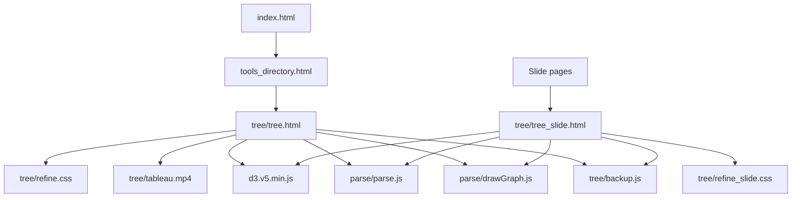
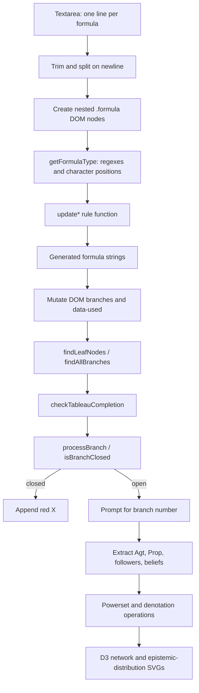
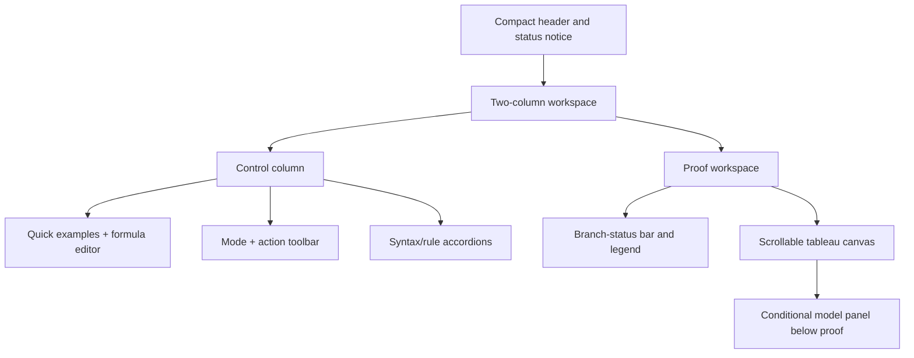

# SAL Tableau Proof Assistant: read-only audit and staged modernization plan

**Repository:** [Raycaesar/Ray.github.io](https://github.com/Raycaesar/Ray.github.io)  
**Public tool:** [SAL Tableau Proof Assistant](https://raycaesar.github.io/Ray.github.io/tree/tree.html)  
**Audited baseline:** `main` at commit [`4780f4a0853e87c224238af75d12dc66008ea3bd`](https://github.com/Raycaesar/Ray.github.io/commit/4780f4a0853e87c224238af75d12dc66008ea3bd)  
**Audit date:** 24 July 2026  
**Scope:** repository and live-page inspection only; no repository files were changed

## 1. Executive verdict

The current application is a functioning but fragile research prototype. It does implement an end-to-end interaction loop—formula entry, manual and partial automatic tableau expansion, branch checking, and model visualization—but its proof state is the rendered DOM, its formulas are unvalidated strings, and its SAL-specific behavior is distributed across regular expressions, character offsets, mutable globals, and event handlers. That combination is adequate for a controlled demonstration, but it is not yet a dependable basis for research results or unassisted teaching.

The immediate visual and explanatory redesign can proceed without first rewriting the algorithms. The safe boundary is strict:

- freeze `tree/backup.js` and `parse/parse.js` byte-for-byte during Stage 1;
- preserve the formula text and branch topology produced by every existing rule;
- restrict any `parse/drawGraph.js` change to defensive UI event wiring, not graph data or semantics;
- place new interaction behavior in a small UI adapter;
- run a DOM-normalized regression corpus before and after the redesign;
- make no new claim of soundness, completeness, decidability, termination, or semantically verified countermodel construction.

Several issues should nevertheless be treated as baseline defects rather than silently incorporated into the redesign:

1. Starting or changing a proof does not clear the previous satisfiable/unsatisfiable message. The page can therefore display an old mathematical result next to a different tableau.
2. **Draw Graph** is always available and asks the user to choose any branch by number; the code does not enforce that the branch is complete and open.
3. Cancelling or submitting an empty response to the arbitrary-box prompt marks the principal formula as used even though no instance was added.
4. Duplicate formula IDs can be generated because three expansion paths shadow the global formula counter with a local counter.
5. The live page raises a load-time JavaScript exception because `parse/drawGraph.js` binds a listener to a missing `#propSize` element.
6. Malformed and unsupported formulas are admitted into the tableau and then fail, misparse, or normalize silently during later operations.

The first two defects make the public interface capable of displaying a materially misleading state. They are P0 UI integrity issues. The arbitrary-box behavior and the meaning of “complete” also have mathematical consequences and must be recorded as baseline behavior, not corrected casually during a visual pass.

The tool should retain its identity as a **tableau proof assistant for Social Announcement Logic**, not be reframed as a generic tree editor. The tableau must remain the visual focus; formulas, branch structure, rule state, and closure evidence must be more legible than decorative elements.

### Overall assessment

| Dimension | Current assessment |
|---|---|
| Demonstration value | Useful when operated by someone who knows the syntax and calculus |
| Public first-use experience | Poor; the video and long rule list precede the actual workspace |
| Behavioral reliability | Mixed; representative expansions work, but state and validation defects are visible |
| Accessibility | Inadequate; core expansion is mouse-only and formula nodes have no interactive semantics |
| Architectural scalability | Low; DOM, syntax, proof state, and rendering are tightly coupled |
| Mathematical assurance | Unestablished by the code audit; SAL rules require manuscript-level cross-checking |
| Research readiness | Not yet research-grade |
| Recommended modernization strategy | Preserve, baseline, and incrementally refactor—do not perform a wholesale rewrite |

## 2. Current application and dependency map

### 2.1 Deployed entry points

The active public application is [`tree/tree.html`](https://github.com/Raycaesar/Ray.github.io/blob/4780f4a0853e87c224238af75d12dc66008ea3bd/tree/tree.html). It is linked from the repository’s public [`tools_directory.html`](https://github.com/Raycaesar/Ray.github.io/blob/4780f4a0853e87c224238af75d12dc66008ea3bd/tools_directory.html), which is in turn reachable from the root site navigation.

There are two related deployed variants:

- `tree/tree_slide.html` is an active presentation embed used as an iframe background by `Slide/Mathematical_Logic.html` and `Slide/Social_Announcement_Logic.html`.
- `Pinetree/tree.html` is an independently linked seasonal “Christmas Tableau” variant. It is not the source of the main tool, although most of its algorithm is duplicated from it.

### 2.2 Active dependency chain



Script order on the main page is significant: D3 loads first, then `parse.js`, `drawGraph.js`, and finally `backup.js`. The current `drawGraph.js` exception stops the remainder of that script, but it does not prevent the next script tag, `backup.js`, from loading. This explains why the tableau still works while some graph event wiring does not.

### 2.3 External and shared dependencies

| Dependency | Where used | Declared version | Audit finding |
|---|---|---:|---|
| D3 | Main tool, slide variant, Pinetree variants | `https://d3js.org/d3.v5.min.js` | Major version 5 is named, but the exact patch is not pinned and there is no integrity hash. `drawGraph.js` uses the D3 v6-style `(event, d)` drag callback signature, so drag behavior is version-mismatched. |
| js-confetti | `Pinetree/tree.html` only | `@latest` | Seasonal-only dependency; not part of the main SAL tool. The floating `latest` version weakens reproducibility. |
| Tailwind browser CDN | `tools_directory.html` only | Unpinned browser CDN | Directory-page presentation dependency, not a proof-tool dependency. |
| Font Awesome | `tools_directory.html` only | 6.6.0 | Directory-page icons only. |
| Browser DOM/SVG APIs | All variants | Browser supplied | Used as both rendering platform and, in `backup.js`, the de facto proof-state store. |

There is no package manifest, build step, framework, backend, database, or test runner. Static GitHub Pages deployment is therefore straightforward and should be preserved in Stage 1.

### 2.4 End-to-end data flow



More precisely:

1. **Input.** The Generate handler reads `#formula-input`, splits it on newline, removes empty lines, and trims each retained line. No grammar validation occurs.
2. **Initial tableau.** Each input line becomes a `.formula` element. Multiple initial formulas are nested vertically rather than stored as a separate premise set.
3. **Classification.** `getFormulaType()` removes free-announcement strings for some checks, then uses anchored regular expressions, single-character offsets, and a depth counter to choose a rule category.
4. **Rule application.** `updateConjunction`, `updateDisjunction`, `updateBeliefWithFreeAnnouncement`, `updateNegationWithFreeAnnouncement`, `updateDiamondSincere`, `updateBoxSincere`, `updateDiamondArbitrary`, or `updateBoxArbitrary` returns strings.
5. **Proof state.** Those strings are inserted as more `.formula` nodes. The principal occurrence is marked with `data-used="true"` and class `expanded`; branch identity is implicit in DOM ancestry.
6. **Completion.** Every nonliteral formula occurrence must have `data-used="true"`. This is the program’s syntactic completion test.
7. **Branch discovery.** DOM leaves are found, then ancestor `.formula` nodes are traversed to reconstruct each branch as a string array.
8. **Closure.** `processBranch()` extracts agents, propositions, beliefs, and follower relations. `isBranchClosed()` checks contradictory network literals and negative belief formulas against intersections of positive belief denotations.
9. **Model extraction.** The user enters a branch number in a native prompt. The selected branch is processed again, follower relations are generated, and D3 renders a social network plus a powerset-style view of epistemic distributions.

There is no stable intermediate representation between these stages. The same string can simultaneously be user syntax, a rule output, a node label, a branch member, and input to the model evaluator.

### 2.5 Runtime-generated controls and output

`backup.js` creates the following at runtime:

- one `.formula` element per initial or derived formula occurrence;
- vertical child nodes and left/right branch containers;
- per-occurrence IDs such as `formula-1`;
- the **Check if Complete** button, inserted after `.tableau-output`;
- red `X` spans appended to leaves judged closed;
- status HTML inside `#messageArea`.

`drawGraph.js` creates or updates:

- social-network SVG nodes, links, labels, and drag behavior in `#networkCanvas`;
- powerset valuation circles, labels, and agent-colored marks in `#beliefCanvas`;
- console diagnostics for agents, followers, propositions, branches, and denotations.

### 2.6 Global variables and shared mutable state

| Global or shared state | Defined in | Purpose and risk |
|---|---|---|
| `formulaIndex` | `tree/backup.js` | Intended global unique ID counter. Local variables with the same name in three expansion paths cause duplicate IDs. It is not reset for a new proof. |
| `agentFollowers` | `parse/parse.js` | Shared follower adjacency object. Mutated by parsing/model functions and reused between proofs. |
| `agentBeliefs` | `parse/parse.js` | Shared epistemic-distribution data. Entries are reset per encountered agent, but the object itself persists. |
| `Agt` | `parse/parse.js` | Current agent vocabulary; reset in `processBranch()`. |
| `Prop` | Created without a declaration in `backup.js` | Implicit global current proposition vocabulary. This depends on non-strict browser execution. |
| `agentColors` | `parse/parse.js` | Persistent color assignment. It is not cleared when a proof is replaced. |
| `colorCounter`, `colors` | `parse/parse.js`, with another local counter in `backup.js` | Color allocation state is split across files. |
| `social`, `svg` | `parse/drawGraph.js` | Top-level graph data and SVG selection. |
| `messageArea` | Used directly in `backup.js` | Relies on the browser exposing an element ID as a global variable. This is fragile and not guaranteed in all execution modes. |
| DOM subtree under `.tableau-output` | All tableau code | Stores occurrence order, parentage, branch splits, used state, leaf state, and closure marks. Any presentational DOM change can therefore alter proof behavior. |

All top-level function declarations in the three JavaScript files also share the page global namespace. There is no module boundary or explicit API.

## 3. Active versus legacy file inventory

“Active” below means imported by, linked from, or embedded in a currently reachable page—not merely similar by filename.

### 3.1 Main tool and shared parser/visualization files

| File | Apparent role | Active status and dependants | Disposition |
|---|---|---|---|
| [`tree/tree.html`](https://github.com/Raycaesar/Ray.github.io/blob/4780f4a0853e87c224238af75d12dc66008ea3bd/tree/tree.html) | Public SAL tableau page, tutorial, rule display, input, proof container, controls, and model SVGs | **Active primary entry point.** Linked from `tools_directory.html`. Imports the five active local/remote dependencies listed above. | **Remain; redesign in Stage 1.** Preserve algorithm-required IDs/classes until a UI adapter owns them. |
| [`tree/refine.css`](https://github.com/Raycaesar/Ray.github.io/blob/4780f4a0853e87c224238af75d12dc66008ea3bd/tree/refine.css) | Main-page layout, tableau lines, node styles, button styles, and fixed SVG sizing | **Active.** Loaded only by the main entry point. | **Replace/refactor in Stage 1.** Retain selectors that the algorithm uses; remove inert or contradictory state styling after tests identify it. |
| [`tree/backup.js`](https://github.com/Raycaesar/Ray.github.io/blob/4780f4a0853e87c224238af75d12dc66008ea3bd/tree/backup.js) | Formula input, classification, all tableau transformations, DOM branch construction, completion, closure, branch selection, and automatic expansion | **Active core.** Used by `tree/tree.html` and `tree/tree_slide.html`. A near-copy is separately used by Pinetree. | **Remain byte-identical in Stage 1. Refactor incrementally from Stage 2 onward.** The filename should eventually be replaced by a purpose-specific module name, but renaming is not a Stage 1 priority. |
| [`parse/parse.js`](https://github.com/Raycaesar/Ray.github.io/blob/4780f4a0853e87c224238af75d12dc66008ea3bd/parse/parse.js) | Propositional tokenization/parsing, set and denotation operations, belief/follower shared state, formula evaluation, and functions originally written for another parser UI | **Active in part.** Model/closure code depends on its parser, powerset, denotation, and globals. Many UI functions reference elements absent from `tree/tree.html` and are dormant there. | **Remain byte-identical in Stage 1. Investigate and split later.** Separate pure propositional semantics from obsolete page bindings. |
| [`parse/drawGraph.js`](https://github.com/Raycaesar/Ray.github.io/blob/4780f4a0853e87c224238af75d12dc66008ea3bd/parse/drawGraph.js) | D3 social-network and epistemic-distribution visualization | **Active, but partially fails during initialization.** Main, slide, and Pinetree pages load it. | **Retain.** Stage 1 may defensively guard/remove bindings to absent controls and duplicate UI listeners; `drawNetwork` and `displayPowerSet` data semantics must remain unchanged. Refactor rendering later. |
| `tree/tableau.mp4` | Embedded 800×400 instructional video; live duration observed as approximately 9:15 | **Active media dependency** of `tree/tree.html`. It dominates the initial viewport. | **Remove the HTML reference in Stage 1.** Keep the asset unreferenced until repository-wide inbound references are checked; archive or delete only in a separately approved cleanup. |

### 3.2 Related main-tree files

| File | Apparent role | Active status and dependants | Disposition |
|---|---|---|---|
| `tree/tree_slide.html` | Video-free presentation version of the tool | **Active.** Embedded by at least two slide pages; imports `refine_slide.css`, D3, `parse.js`, `drawGraph.js`, and the same `backup.js`. | **Remain.** Give it a minimal Stage 1 parity pass or a documented embed mode so fixes do not diverge. |
| `tree/refine_slide.css` | Compact styling for the slide version | **Active.** Used by `tree_slide.html`. | **Remain; consolidate later.** Prefer a shared base stylesheet plus an embed modifier after Stage 1 behavior is frozen. |
| `tree/botany.js` | Exploratory console harness with sample formula arrays and commented experimental functions | **Inactive.** Not imported by either active tree page. It calls functions whose local definitions are commented, so loading it independently is not a reliable test. | **Archive after extracting useful examples into tests.** Do not treat it as production logic. |

### 3.3 Pinetree seasonal fork

| File | Apparent role | Active status and dependants | Disposition |
|---|---|---|---|
| `Pinetree/tree.html` | Christmas-themed tableau page without the instructional video | **Active separate public page.** Linked from `tools_directory.html`; imports Pinetree CSS/JS, shared parser/graph code, D3, and js-confetti. | **Keep outside Stage 1.** Label as a seasonal fork; later make it a theme wrapper over a shared tested core if it remains public. |
| `Pinetree/backup.js` | Seasonal copy of the tableau algorithm plus confetti behavior | **Active in Pinetree only.** Algorithmically the same as the main `backup.js` apart from 13 confetti-related lines at the audited commit. | **Do not mine as a new core.** Freeze and compare against main; deduplicate only after regression tests exist. |
| `Pinetree/refine.css` | Red/green/Great Vibes seasonal theme | **Active in Pinetree.** | **Retain as a theme reference, not as modernization work.** |
| `Pinetree/refine_slide.css` | Seasonal slide styling | Its matching `tree_slide.html` has no inbound reference found in the inspected repository. | **Further investigation; likely dormant.** |
| `Pinetree/tree_slide.html` | Seasonal slide/embed page | **No active inbound reference found.** It still points at shared parser/graph code and Pinetree assets. | **Label dormant after an inbound-link check.** |
| `Pinetree/botany.js` | Exact duplicate of `tree/botany.js` | **Inactive.** | **Archive with the main copy after fixtures are migrated.** |

The Pinetree fork contains no more advanced proof architecture or accessibility work that should be ported back. Its only reusable concept is theming; its duplicated algorithm is a maintenance liability.

### 3.4 Repository navigation and snapshot material

| File or group | Apparent role | Active status and dependants | Disposition |
|---|---|---|---|
| `tools_directory.html` | Public tools directory | **Active.** Links both the main “Tableau Generator” and “Christmas Tableau.” | **Small Stage 1 copy change.** Rename and describe the main tool accurately as the experimental SAL Tableau Proof Assistant. |
| `index.html` | Main site entry/navigation | **Active.** Links the tools directory rather than the proof page directly. | **Remain.** No Stage 1 change required unless navigation wording is standardized. |
| `main_page_reserved.html` | Alternative/reserved site page | No evidence that it is the public route to this tool. | **Further investigation before archive.** Not a Stage 1 dependency. |
| `examples/Tableau Proof Assistant_files/backup.js.download` | Saved-page snapshot of an earlier core script | **Not an active dependency of the main page.** It is almost the same algorithm, with proposition extraction `[p-z]` rather than current `[g-z]`. | **Preserve temporarily as forensic history; do not reuse.** Determine the status of its parent saved example before archive. |
| `examples/Tableau Proof Assistant_files/drawGraph.js.download` | Saved-page graph script | **Not active.** Differs mainly in force parameters and logging. | **Forensic only; investigate with the parent example.** |
| `examples/Tableau Proof Assistant_files/parse.js.download` | Saved-page parser script | **Not active.** Effectively the same parser snapshot. | **Forensic only.** |
| `examples/Tableau Proof Assistant_files/refine.css` | Saved-page stylesheet | **Not active.** Matches the main active CSS at the audited baseline. | **Forensic only.** |

The saved-page assets appear to support a separately stored example, but they do not participate in the live SAL entry point. They should not be deleted solely because they are duplicates; first determine whether the associated example is intentionally archival.

## 4. Current user workflow

### 4.1 What a user presently does

1. The user lands on a page headed **Tableau Proof Assistant**.
2. A large embedded video appears before the text instructions and workspace.
3. The user reads a long “Formulas of ASAL” list and eight static tableau-rule diagrams.
4. The user enters formulas in an unlabeled textarea with placeholder **Enter formulas here...**.
5. **Generate Tableau** clears only the proof DOM and nests each nonempty input line into a single initial path.
6. The user double-clicks a compound formula to expand it. A single click highlights descendant leaves but does not persistently select the principal formula.
7. For arbitrary sincere announcements, the browser opens a native prompt.
8. The user may press **Auto Expansion**, which recursively expands the six hard-coded non-arbitrary categories.
9. A JavaScript-created **Check if Complete** button checks the `data-used` flags and then evaluates each discovered branch.
10. Closed leaves receive a red `X`; `#messageArea` reports the set satisfiable or unsatisfiable under the current implementation.
11. The user may press **Draw Graph** at any time. A prompt asks for a branch number and an alert rejects an out-of-range value.
12. The page draws the selected branch’s social network and epistemic distributions in large fixed-width SVGs.

There is no integrated “new proof” operation. Pressing **Generate Tableau** with new input replaces the formula DOM, but does not clear the old result message, graph state, persistent globals, or agent colors.

### 4.2 User-visible operations

| Operation | Present control/gesture | Current result |
|---|---|---|
| Enter formulas | Unlabeled textarea | One nonempty trimmed line becomes one formula occurrence. |
| Start/replace tableau | **Generate Tableau** | Clears `.tableau-output` and creates a nested initial chain. It does not clear status or model output. |
| Inspect descendants | Single-click a formula | Clears existing formula styles, highlights current descendant leaves, and logs the clicked formula, offspring, and leaves. |
| Expand manually | Double-click a formula | Applies the category selected by `getFormulaType()`. Non-arbitrary principals lose the double-click handler after one successful expansion. |
| Instantiate arbitrary diamond | Double-click `<a!>φ` | Repeatedly prompts until a string not found anywhere in the tableau is entered, or cancellation occurs. |
| Instantiate arbitrary box | Double-click `[a!]φ` | Prompts for any message and remains double-clickable for additional instances. |
| Expand automatically | **Auto Expansion** | Recursively applies conjunction, disjunction, explicit sincere diamond/box, and positive/negative free-update rules. It skips arbitrary diamond/box. |
| Check completion/closure | Runtime **Check if Complete** | Reports incomplete, or enumerates branches and marks judged-closed leaves with `X`. |
| Choose model branch | **Draw Graph**, then native prompt | Accepts a one-based branch number without checking that it is open or complete. |
| View extracted network | Network SVG | Displays agents and follower links with D3. |
| View epistemic distributions | Belief SVG | Displays powerset valuations and agent markings. |

### 4.3 Supported formula and rule categories

The following are **implementation-recognized string categories**, not a claim that they exactly match the current formal SAL language.

| Category returned by `getFormulaType()` | Representative input | Current expansion role |
|---|---|---|
| `atomic belief` | `Bap` | Terminal for syntactic completion; positive belief contributes to the extracted epistemic distribution. |
| `atomic negation` | `~Bap` | Terminal; used by closure checking against the positive-belief intersection. |
| `following formula` | `bFa`, `~bFa` | Terminal network literal; opposite literals close a branch. |
| `conjunction` | `(Bap&Baq)` | Adds both conjuncts vertically. |
| `disjunction` | `(Bap+Baq)` | Splits into two branches. |
| `belief with free announcement` | `[a:p]Bbq` | Splits into a direct belief branch and an implication-plus-follower branch. |
| `negation with free announcement` | `[a:p]~Bbq` | Splits into a negated implication branch and a negated-belief-plus-negative-follower branch. |
| `diamond sincere` | `<a!p>Bbq` | Adds `Bap`, then `[a:p]Bbq` vertically. |
| `box sincere` | `[a!p]Bbq` | Splits into `~Bap` and `[a:p]Bbq`. |
| `diamond arbitrary` | `<a!>Bbq` | Prompts for a purported fresh string and produces an explicit sincere-diamond instance. |
| `box arbitrary` | `[a!]Bbq` | Prompts for any message and produces an explicit sincere-box instance; intended to remain repeatable. |

Free-announcement prefixes are accepted before several compound categories and are copied onto generated formulas. The classifier is not a grammar: for example, any string beginning with `B` followed by a lowercase letter is classified as an atomic belief regardless of whether the remainder is well formed.

The propositional parser in `parse.js` separately supports:

- lowercase atomic symbols;
- negation `~`;
- conjunction `&`;
- disjunction `+`;
- implication `>`;
- parentheses.

That parser is primarily reached during closure/model processing. It does not validate the modal/SAL string before the tableau is created.

### 4.4 Current output forms

- nested HTML formula nodes and CSS-drawn branch connectors;
- blue leaf highlighting after formula interaction;
- class/attribute state (`expanded`, `data-used`) that is mostly not communicated visually;
- red `X` characters appended to closed leaves;
- prose completion/satisfiability messages;
- native browser prompts and one alert;
- extensive console diagnostics;
- a D3 social-network SVG;
- a D3 powerset/epistemic-distribution SVG.

There is no proof export, rule provenance, closure explanation attached to a branch, model truth report, downloadable image, stable proof ID, or replay format.

### 4.5 Browser dialogs, prompts, and generated messages

| Trigger | Exact current text | Finding |
|---|---|---|
| Arbitrary diamond | `Enter a unique variable (suggested: x, y, z, u, v, w):` | “Variable” and “unique” are underspecified; validation is only a substring search over all tableau text. |
| Arbitrary box | `Enter any message (suggested: no need to use new variables):` | Does not state accepted grammar or the effect of cancel/empty input. |
| Model branch selection | `Enter the number of the open branch you want to select (e.g., 1 for the first branch):` | The prompt calls it open, but the program accepts any enumerated branch. |
| Invalid branch alert | `Invalid branch number. Please enter a valid number.` | Routine recoverable error uses a blocking alert and gives no valid range. |
| Incomplete tableau | `The tableau is not yet complete. Continue expanding formulas.` | Does not identify occurrences or distinguish syntactic completion from fair saturation. |
| Some open branch | `The set of formulas is satisfiable. Click 'Draw Graph' button to generate a model. Branch n is open.` | Overstates what has been established: no independent soundness/fairness check or extracted-model truth check is performed. |
| All branches closed | `The set of formulas is unsatisfiable.` | Also stronger than the audit can certify without matching the implementation to the formal calculus. |

### 4.6 Fixed assumptions and hidden constraints

| Assumption | Publicly stated? | Actual mechanism |
|---|---|---|
| Agents are single lowercase letters, intended `a`–`e` | Yes, in apologetic prose | Some regexes accept any `a`–`z`; follower extraction/closure narrows some positions to `a`–`e`. Behavior is inconsistent. |
| Propositions are intended `p`–`z` | Yes | `processBranch()` currently extracts every `[g-z]` character not already recognized as an agent. The saved earlier script used `[p-z]`. |
| Indexed symbols are unsupported | Yes | The classifier/tokenizer contains partial indexed-token patterns, while downstream character indexing silently collapses or misreads them. |
| Binary formulas require outer parentheses | Yes | The conjunction/disjunction splitter assumes them, but the page does not validate them before rendering. |
| Syntax is ASCII | Implicit | Rules depend on `B`, `F`, `~`, `&`, `+`, `>`, `<...>`, `[...]`, `:`, and `!` at fixed positions. |
| One formula per line | Only implied by behavior | Input is split solely on newline. |
| No spaces within formulas | Not clearly stated | Only leading/trailing whitespace is trimmed. Internal spaces can defeat regexes or become part of a message. |
| Arbitrary-diamond witness is “fresh” | Rule text says a new atomic message absent from ancestors | Code accepts any nonempty string absent as a substring from the entire tableau; it is neither restricted to one atom nor scoped to ancestors. |
| Arbitrary box may be instantiated repeatedly | Not clearly explained | Its double-click handler remains attached after use; all other successful principals are disabled. |
| Automatic expansion omits arbitrary formulas | Stated briefly | Hard-coded whitelist confirms this. |
| A complete open branch can yield a model | Stated | The button is not gated, and there is no certified-finished flag or semantic truth report. |

## 5. Behavioural baseline and regression corpus

### 5.1 How to preserve this baseline

The corpus below should be captured as browser-driven regression fixtures before Stage 1 implementation. For proof-output comparisons, normalize away:

- generated numeric IDs, because duplicate-ID behavior is separately tested;
- purely presentational classes;
- whitespace introduced by layout;
- SVG force-layout coordinates.

Do **not** normalize away:

- formula text;
- parent/child and left/right branch topology;
- occurrence order;
- `data-used`;
- prompt occurrence and entered value;
- status text;
- branch count;
- red closure marks;
- extracted agent/proposition/follower/denotation data.

Every live test currently also encounters the page-load console exception:

```text
TypeError: Cannot read properties of null (reading 'addEventListener')
    at .../parse/drawGraph.js:178:36
```

This is caused by a top-level listener for absent `#propSize`. It is a global baseline defect rather than a result of any particular formula.

### 5.2 Representative regression cases

| ID | Exact input and action | Expected current expansion/response | Visible output | Console/error evidence | Assessment |
|---|---|---|---|---|---|
| R01 | `Bap`; Generate; Check | No rule expansion. Completion treats it as terminal; branch remains open. | Node `Bap`; message reports satisfiable and Branch 1 open. | Added-formula, branch, `Agt: ['a']`, proposition/denotation, and “Branch is open” diagnostics; plus the global load error. | **Clearly correct as a record of current terminal behavior.** Mathematical satisfiability is plausible but not certified by this audit. |
| R02 | `~Bap`; Generate; Check | No rule expansion. With no positive `Ba...` restriction, current belief domain is not a subset of `p`; branch remains open. | Node `~Bap`; open/satisfiable message. | Branch and denotation diagnostics; no case-specific exception. | **Clearly correct as current behavior; mathematical closure design requires formal cross-check.** |
| R03 | `(Bap&Baq)`; Generate; double-click root | `Bap` followed vertically by `Baq`; root gets `data-used="true"` and `expanded`; its double-click handler is removed. | Three formula labels in one vertical path; `Baq` is the leaf. | Logs `Expanding formula`, type, and `vertical: Bap vertical1: Baq`. | **Clearly correct propositional tableau behavior.** |
| R04 | `(Bap+Baq)`; Generate; double-click root | Left branch `Bap`; right branch `Baq`. | A two-way branch under the principal formula. | Logs left/right output and branch construction. | **Clearly correct propositional tableau behavior.** |
| R05 | `[a:p]Bbq`; Generate; double-click root | Left output `Bbq`; right output `Bb(p>q)` with `bFa` beneath it. | Two branches; the right branch contains two vertical formulas. | Logs `Left: Bbq`, `Right: Bb(p>q)`, `Right1: bFa`. | **Mathematically unresolved.** It matches the coded and displayed rule, but must be checked against the current SAL calculus. |
| R06 | `[a:p]~Bbq`; Generate; double-click root | Left output `~Bb(p>q)`; right output `~Bbq` with `~bFa` beneath it. | Two branches with the negative follower literal on the second branch. | `rightOutput1` is constructed with a leading space before `~bFa`; node creation trims it. | **Mathematically unresolved.** Requires rule-specification comparison. |
| R07 | `<a!p>Bbq`; Generate; double-click root | Vertical `Bap`, then `[a:p]Bbq`. | One path with two generated occurrences. | Regex-match and generated-string diagnostics. | **Mathematically unresolved.** Current implementation is internally consistent with the page’s rule diagram. |
| R08 | `[a!p]Bbq`; Generate; double-click root | Left `~Bap`; right `[a:p]Bbq`. | Two branches. | Left/right rule diagnostics. | **Mathematically unresolved.** Requires manuscript cross-check. |
| R09 | `<a!>Bbq`; Generate; double-click; enter `x` | Adds `<a!x>Bbq`, marks the arbitrary-diamond principal used, and disables its double-click handler. | One child labelled `<a!x>Bbq`. | Native prompt; logs parsed agent/remainder and `vertical`. | **Mathematically unresolved.** The generated string is the coded rule, but “fresh” is implemented as whole-tableau substring absence, not the stated ancestor-scoped atomic condition. |
| R10 | `[a!]Bbq`; Generate; double-click; enter `p` | Adds `[a!p]Bbq`; marks the principal used but leaves it double-clickable for additional messages. | One new child; another double-click can add another instance. | Native prompt and `vertical: [a!p]Bbq`. | **Mathematically unresolved.** Repeatability exists, but the completion/fairness meaning is not formalized. |
| R11 | `[a!]Bbq`; Generate; double-click; cancel or submit empty | No child is generated, yet `expandFormula()` unconditionally marks the principal used and adds `expanded`. | Formula appears unchanged; completion can later treat it as handled. | No explicit user-visible error. | **Clearly defective.** Control flow records an application that did not occur. |
| R12 | `bFa`; Generate; Check, then repeat with `~bFa` | Each literal is terminal and individually open. | One formula and open/satisfiable message in each run. | Agent/follower diagnostics. | **Clearly correct as current network-literal behavior.** |
| R13 | `bFa` newline `~bFa`; Generate; Check | Opposite follower literals are found on the same initial path; branch closes. | Two nested formula nodes, red `X`, unsatisfiable message. | Logs the contradictory pair. | **Clearly correct direct contradiction detection.** Rechecking can append another `X`, which is separately defective. |
| R14 | `(Bap+Baq)` newline `~Bap` newline `~Baq`; Generate; expand the disjunction; Check | The intended baseline is two branches, one conflicting on `p`, the other on `q`, with all branches reported closed. | Two closed leaves/red marks and unsatisfiable message. | Branch arrays and subset-based closure diagnostics. | **Clearly correct target result for this corpus, but branch distribution/topology must be snapshotted because initial formulas and later branches share DOM ancestry.** |
| R15 | `Bap` newline `~Baq`; Generate; Check | One finished open path. `Agt=['a']`, `Prop=['p','q']`; positive `Bap` restricts `a` to `p`-worlds and `~Baq` does not close it. | Open Branch 1 message. | Denotation and branch diagnostics. | **Implementation-consistent; mathematical completeness is unresolved.** |
| R16 | R15, then Draw Graph, choose branch `1` | Processes the selected path; no social links; valuations over `{p,q}`; agent `a` is marked on the `p` valuations. | Network SVG with agent `a`; powerset SVG with four valuation circles and `a` on `{p}` and `{p,q}`. | Selected branch, follower, agent, proposition, and denotation logs. Clicking a valuation can later call undefined `handleNodeClick`. | **Mathematically unresolved.** It is a useful expected visualization, not a certified countermodel. |
| R17 | `(Bap&Baq`; Generate; double-click | Classifier sees a top-level conjunction, while `slice(1,-1)` removes the last `q`; current splitting can generate `Bap` and `Ba`. Later checking/parsing may fail. | Malformed input is still shown and can create malformed children; no inline validation. | Downstream error depends on the next operation; exceptions are uncaught. | **Clearly defective.** A malformed formula is silently transformed. |
| R18 | `K_ap`; Generate; double-click or Auto/Check | Initial node is created. Classification throws `Unknown formula type: K_ap`. | No useful inline error; action stops. | Uncaught `Error: Unknown formula type: K_ap`. | **Clearly defective error handling.** The syntax is unsupported, but the failure is not safely reported. |
| R19 | `Ba_1p`; Generate; Check | Classified immediately as `atomic belief`; downstream character indexing treats agent as `a` and message as `_1p`, while the propositional tokenizer can discard punctuation/index structure. | May be reported open rather than rejected despite the page’s prohibition on indexed names. | No guaranteed exception; silent normalization/misinterpretation is possible. | **Clearly defective input handling; mathematical meaning is undefined.** |
| R20 | `(Bap&Baq)`; Generate; double-click twice | First double-click expands; successful non-box expansion sets `ondblclick=null`, so the second does nothing. | No duplicate children from the second gesture. | No second expansion log. | **Clearly correct repeat-protection for this rule.** |
| R21 | `<a!p>Bbq`; Generate; Auto Expansion | Recursively produces `Bap`, `[a:p]Bbq`, then the free-update branches `Bbq` and `Bb(p>q)` with `bFa`. Arbitrary rules are not applied. | Fully expanded non-arbitrary visible tree. | Repeated rule logs. Generated formula IDs can collide because local counters shadow the global. | **Expansion content is implementation-consistent; duplicate IDs are clearly defective; SAL semantics remain unresolved.** |
| R22 | `Bap` newline `~Baq`; Generate | Multiple inputs form one vertical DOM path rather than sibling roots or an explicit premise block. | `~Baq` is nested under `Bap`. | Logs two added formulas with global IDs. | **Clearly correct description of current behavior.** Whether this representation is mathematically appropriate is unresolved but it is equivalent to a premise set only if later branch handling preserves both on every split. |
| R23 | Start any checked closed proof; replace input with `(Bap&Baq)`; Generate, without Check | New formula DOM is created, but the old result message remains. | New tableau beside stale “unsatisfiable” or “satisfiable” text. | No error; status is simply not cleared. | **Clearly defective and misleading (P0).** |
| R24 | Any incomplete or known-closed tableau; press Draw Graph and choose an in-range branch | Model processing proceeds because only the numeric range is validated. | A network/distribution may be displayed for a branch the page knows is closed or has not checked. | No precondition failure. | **Clearly defective and misleading (P0).** |
| R25 | `bFa` newline `~bFa`; Check twice | Each check appends another red `X` span to the same leaf. Because branch discovery is DOM-leaf based, appended nonformula nodes can also perturb later leaf traversal. | Multiple `X` marks can accumulate. | Repeated closure logs. | **Clearly defective repeatability/idempotence.** |

### 5.3 Baseline conclusions

- The six non-arbitrary expansion patterns exercised above generate stable, inspectable formula strings and are suitable for Stage 1 regression snapshots.
- SAL-specific rule validity cannot be inferred from visual agreement between static rule diagrams and the same JavaScript implementation.
- “Complete,” “open,” “satisfiable,” and “model” are currently presented as stronger conclusions than the implementation evidence supports.
- Baseline tests must include interactions and state invalidation, not only rule-output text. The most serious current public errors are stale results and ungated model construction.

## 6. UI/UX audit

### 6.1 Severity scale

- **P0:** prevents reliable use or can display a materially misleading proof/model state.
- **P1:** seriously impairs understanding, accessibility, or completion of a principal task.
- **P2:** worthwhile improvement with clear user value.
- **P3:** polish or consistency improvement.

### 6.2 P0 findings

| Finding | Evidence | Consequence | Stage 1 response |
|---|---|---|---|
| Previous proof status survives a new tableau | Generate clears only `.tableau-output`; live testing showed the old result beside a new proof. | A user can attribute a satisfiable/unsatisfiable result to the wrong input. | Invalidate and clear completion/model status on input submission and any proof mutation, without changing the checker. |
| Model generation has no enforced preconditions | **Draw Graph** is always enabled; branch selection validates only an integer range. The page itself says choosing a closed branch is “not advisable.” | A visualization can be mistaken for a countermodel even for a closed or incomplete branch. | Disable model controls until the unchanged checker has just reported at least one open branch; list only those branches. Invalidate availability after any expansion. |
| Malformed/unsupported input fails after entering proof state | Generate accepts every nonempty line; later operations throw or misparse. | Users cannot distinguish a typo from unsupported syntax or a failed proof step. | Add visible preflight feedback and catch/display existing-function exceptions. Stage 1 validation must not rewrite or normalize accepted formulas. |
| Arbitrary-box cancel/empty marks the formula used | `expandFormula()` sets success unconditionally for `box arbitrary`. | A branch can appear syntactically complete although no instance was added. | Preserve as a documented baseline mathematical defect; if fixed, do so in a separate algorithmic patch after a rule-specific test and specification decision—not hidden in visual work. Stage 1 UI can prevent an empty submission and explain cancellation, but must not claim this cures fairness. |

### 6.3 P1 findings

| Area | Finding |
|---|---|
| Information hierarchy | A roughly 9:15 video and full rule catalogue precede the workspace. At a 1348×921 viewport, the proof controls are far below the fold. |
| First-time comprehension | The page says how operators look, but not what problem the tool answers, what a tableau occurrence represents, or what the safe workflow is. “ASAL” is not reconciled with the project’s “SAL” name. |
| Action discoverability | **Check if Complete** is created after page load in a different location; **Auto Expansion** is embedded inside a sentence; **Draw Graph** is far below the proof. There is no coherent toolbar. |
| Manual expansion | The essential gesture is double-clicking a plain `div`. There is no persistent selection, explicit expand action, rule preview, keyboard equivalent, or visual affordance that a node is interactive. |
| Automatic expansion | Its label does not say which rules it omits, whether it runs to a fixed point, or whether completion is certified. There is no busy/progress state. |
| Branch selection | Branches have no stable visible numbers until a prompt describes an implied left-to-right order. The prompt is detached from the canvas. |
| Completion and closure | A red `X` is the only branch-specific closed indicator; no closure reason is shown. Open leaves are not labelled. “Complete” conflates used flags with a mathematically finished/fair branch. |
| Countermodel generation | The page calls the section **Model**, gives a warning in prose, and allows the action regardless of state. Network and epistemic views are two large SVGs rather than a subordinate, contextual panel. |
| Error reporting | Routine errors use prompts, alerts, exceptions, or console logs. There is no inline error summary or line-specific feedback. |
| Proof-state distinction | JS adds `expanded`, but CSS has no effective `.expanded` presentation. CSS targets `.formula.data-used`, which is a class selector, while JS sets a `data-used` attribute. Expandable, expanded, selected, open, and closed states are therefore not reliably distinguished. |
| Horizontal navigation | Before any proof is drawn, the 1800px belief SVG makes the document 1820px wide at a 1348px viewport. The whole page horizontally scrolls instead of containing overflow inside the proof/model panels. |
| Vertical scale | The live document is about 3912px tall before meaningful proof growth. Rules and graphics force long travel between input, proof, status, and model. |
| Laptop responsiveness | Fixed 800px video, 1200px network SVG, and 1800px belief SVG do not adapt to ordinary laptop widths. |
| Mobile usability | Wide static rule trees, fixed SVGs, small formula nodes, and double-click interaction make mobile use impractical. Stage 1 should be responsive, but complex proof authoring can still be documented as desktop-first. |
| Keyboard access | Formula occurrences are nonfocusable `div`s; double-click has no keyboard equivalent. The main proof operation is unavailable to keyboard-only users. |
| Screen readers | No `<main>`, `<header>`, `<nav>`, `<footer>`, form label, status live region, interactive formula role, branch grouping, or accessible closure description was found. |
| Color/meaning | Leaf highlight and closed state rely principally on blue/red visual marks. State needs text/icon/shape as well as color. |
| Reset/restart | There is no comprehensive reset. Generate replaces formula nodes but leaves status, SVG output, and mutable global state. |
| Accidental destructive action | Generate immediately discards the visible proof with no distinction between “start” and “replace.” For a nonpersistent tool, confirmation is unnecessary if the button is named **New proof** and the unsaved effect is clear. |

### 6.4 P2 findings

- The static rule reference is useful but too prominent. It should be a collapsible help panel and must be labelled as the patterns implemented by this prototype, not as independent validation.
- The input lacks examples, per-line state, a syntax summary adjacent to the editor, and a visible empty state.
- Formula occurrence IDs are invisible, so users cannot discuss or cite a specific occurrence.
- No displayed provenance explains which rule produced a formula, from which principal occurrence, or with which arbitrary message.
- No displayed reason explains whether closure came from opposite follower literals or a belief/denotation subset condition.
- There is no legend for pending, expandable, expanded, selected, open, and closed states.
- D3 views lack an explicit empty state, a fit/reset control, responsive `viewBox`, and accessible textual summary.
- There is no loading or “working” state for automatic expansion or powerset rendering. Large proposition sets can appear to freeze the page.
- The network and epistemic displays do not expose their data in a text/table alternative.
- Quick-start examples are absent despite suitable examples already implicit in the code and tutorial.
- The public tools-directory card calls the application a generic “Tableau Generator,” weakening its SAL identity.

### 6.5 P3 findings

- Heading levels and capitalization are inconsistent: “Counter-Model,” “Model,” “Tableau Output,” and button title case do not form one style.
- Cards, rule diagrams, workspace, and status lack a coherent spacing and panel hierarchy.
- Formula typography is not intentionally separated from interface typography.
- Native prompts and the fixed SVG styling visually disconnect arbitrary-rule and model tasks from the proof workspace.
- There is no restrained dark-mode strategy. Dark mode should be deferred rather than added without tested proof-state contrast.

## 7. Public copy and documentation audit

### 7.1 Existing HTML copy

The following table accounts for every user-visible sentence or sentence group in the active `tree/tree.html`, including control labels and media fallback.

| Current copy | Finding | Recommended treatment |
|---|---|---|
| `Tableau Proof Assistant` | Too generic; omits SAL. | Replace with **SAL Tableau Proof Assistant** in the document title and `h1`. |
| `Your browser does not support the video tag.` | Obsolete after the already-decided video removal. | Remove with the video. Do not replace with another video in Stage 1. |
| `Formulas of ASAL:` | Project naming conflicts with the requested SAL identity; “formulas” section does not define the supported fragment precisely. | Use **Accepted syntax** and identify the implementation as the current SAL prototype. Resolve ASAL/SAL terminology against the manuscript before making a formal claim. |
| `Literal Belief formula: Baθ or ~Baθ where a is an element of Agents and θ is an element of Prop.` | Grammar/capitalization are awkward; notation uses Greek metavariables the input cannot accept literally; “literal” may be formally misleading. | Explain concrete ASCII syntax with `Bap` and `~Bap`, plus a short metavariable note in help. |
| `Conjunction: Use the ampersand symbol & between two formulas. E.g., (φ&ψ) where both φ and ψ are formulas.` | Repeats “formulas”; does not say outer parentheses are required in the implementation. | `Conjunction: (φ&ψ). Outer parentheses are required.` |
| `Disjunction: Use the plus symbol + between two formulas. E.g., (φ+ψ).` | Reasonable but should be paired with the same parenthesis rule and concrete examples. | Condense in a syntax table. |
| `Free Announcement: Use the symbol [a:θ] before the formula. E.g., [a:θ]φ.` | Does not explain that the message is parsed propositionally, which nesting is supported, or that names are single characters. | Use concrete `[a:p]Bbq`; place scope/details in the syntax accordion. |
| `Diamond Sincere Announcement: Use the symbol <a!θ> before the formula. E.g., <a!θ>φ.` | “Diamond sincere” word order is inconsistent with other terms; no accepted concrete example. | Use **Explicit sincere diamond** and `<a!p>Bbq`. |
| `Box Sincere Announcement: Use the symbol [a!θ] before the formula. E.g., [a!θ]φ.` | Same issue. | Use **Explicit sincere box** and `[a!p]Bbq`. |
| `Diamond Arbitrary Announcement: Use the symbol <a!> before the formula. E.g., <a!> φ.` | Contains a space that the parser does not intentionally support; does not explain the manual fresh-message prompt. | Use `<a!>Bbq`; explain that manual expansion requests an instance and that automatic expansion skips it. |
| `Box Arbitrary Announcement: Use the symbol [a!] before the formula. E.g., [a!]φ.` | Does not explain repeatability/fairness or manual instantiation. | Use `[a!]Bbq` and a cautious explanation. |
| `Brackets: Every formula connected by a binary operator should be enclosed within a pair of brackets. E.g., (φ+ψ), not φ+ψ.` | Calls parentheses “brackets,” which is ambiguous because square brackets already denote boxes/announcements. | `Parentheses: enclose every binary formula, for example (Bap+Baq).` |
| `Tableau Rules` | Sounds authoritative despite no rule-version citation. | Use **Implemented tableau-rule reference** with an audit-status caveat. |
| `where [b:γ]...[c:χ] is either a sequence of free announcement operators or empty and p is a new atomic message which does not occur in any ancestor.` | Grammatically incomplete as a standalone sentence; `p` clashes with the concrete proposition range; code checks whole-tableau substring absence rather than ancestors and permits nonatoms. | Do not publish this as an implementation guarantee. State the intended side condition and separately disclose the prototype limitation until fixed. |
| `Due to my fault, currently agents should be only denoted by one letter from a to e. And propositional variable should be from p to z. Do not use a_1, b_2, p_1, x_2 and etc..` | Apologetic, unprofessional, grammatically incorrect, and inconsistent (`variable` should be plural; “and etc.” is redundant; double period). The restriction is also only partly enforced. | Replace with a neutral **Current naming restrictions** note and validated examples. |
| `Enter formulas here...` | Vague; does not say one per line or give a concrete form. | Use the proposed multiline placeholder in section 9. |
| `Generate Tableau` | “Generate” can imply automatic proof search; it actually initializes the DOM. | Use **Start tableau** for the first run and **New proof** once a proof exists. |
| `Tableau Output` | Generic and visually secondary despite being the main task. | Use **Proof workspace** with an empty-state instruction. |
| `Expand the tableau by double clicking compound formula. Or do it automatically except arbitrary formulas.` | Grammar errors (“double-clicking a compound formula”); double-click is undiscoverable/inaccessible; “arbitrary formulas” is ambiguous. | Replace with explicit mode/control copy and an automatic-expansion limitation. |
| `Auto Expansion` | Noun phrase is vague and does not expose scope. | Use **Auto-expand non-arbitrary rules**. |
| `Closure Condition` | Singular heading for two bullets; does not distinguish implemented checks from a complete formal definition. | Use **Implemented closure checks** and link to the formal specification when available. |
| `A branch is closed if it contains a formula ~Baθ such that θ is a tautology, or, in addition, formulas Baθ1, ...Baθn such that (θ1 & ... & θn > θ) is a tautology.` | Dense and grammatically awkward. The code implements a finite-valuation subset test after proposition extraction, not an explicitly reported tautology proof. | Keep only in help, rewrite precisely after calculus/code cross-check, and avoid claiming more than the implemented check. |
| `A branch is closed if it contains both bFa and ~bFa.` | Clear in isolation, but should explain occurrence/branch scope and concrete agent restrictions. | Keep as a concise implemented check. |
| `Model` | Too strong and detached from preconditions. | Use **Extracted model candidate** until semantic verification exists, or **Model from a finished open branch** with a prominent experimental qualifier. |
| `Draw Graph` | Describes rendering rather than the logical action. | Use **Build model from selected branch**. |
| `Please choose an open branch when prompted, selecting from left to right. Opting for a closed branch to create a model is not advisable.` | The interface asks the user to maintain a critical invariant it can check itself; “not advisable” minimizes an invalid operation. | Remove. Gate the control and provide a visible branch selector containing only currently reported open branches. |

The eight static rule diagrams also contain terse labels such as `[:]∨`, `[:]∧`, `[:]K`, `<!θ>`, and `[!]` without a legend. They are compact for an expert but unsafe as first-use documentation. Preserve the formulas, but add rule names, principal/generated occurrence labels, and side-condition notes in the collapsible reference.

### 7.2 JavaScript-generated public messages

The prompt, alert, status, and button strings listed in section 4.5 are the complete routine user-facing strings found in the active JavaScript path. Their principal problems are:

- native modal UI rather than contextual controls;
- no formula-line or occurrence reference;
- no accepted-grammar guidance;
- no valid branch range;
- “unique variable” not matching the actual check;
- “complete” not distinguishing syntactic used-state from fairness;
- satisfiable/unsatisfiable conclusions presented without prototype qualification;
- model instruction given before extraction preconditions are enforced.

Console output is extensive but is not a substitute for public feedback. It includes formula additions, clicks, offspring/leaves, rule outputs, branch arrays, closure reasons, agents, propositions, follower maps, belief denotations, and selected branch data. Useful closure/provenance information should eventually be promoted into structured UI state, while development-only logs should be gated or removed in a later stage.

### 7.3 What the public page should explain

The final concise help content should cover:

1. **Purpose:** explore the currently implemented SAL tableau rules and inspect candidate models from checker-reported open branches.
2. **Supported system:** a precise, versioned fragment/calculus statement once reconciled with the manuscript; until then, call it the “currently implemented SAL prototype syntax.”
3. **Input:** ASCII syntax, one formula per line, concrete examples, name restrictions, and required parentheses.
4. **Starting:** entering premises and choosing **Start tableau**.
5. **Manual expansion:** select an expandable occurrence and use **Expand selected**; arbitrary rules request a message.
6. **Automatic expansion:** runs the current non-arbitrary whitelist to a programmatic fixed point; it does not instantiate arbitrary announcements or prove fair completion.
7. **Closure:** the exact implemented closure checks, clearly distinguished from a claim that the calculus is complete.
8. **Model generation:** only after a fresh completion check reports a finished open branch; selection, output tabs, and lack of independent truth certification.
9. **Limitations:** names, syntax, full-SAL termination, arbitrary-rule strategy, validation, proof certificates, and model verification.
10. **Status:** experimental software.
11. **Attribution:** author, related manuscript/calculus version, source repository, contact route, and an archived-release citation when one exists.

### 7.4 Language recommendation

Adopt **English-first with a Chinese toggle**, implemented only after the English terminology and formal system description have been verified.

Reasons:

- English is the common language for the project’s international academic and research audience and should remain the stable citation/reference language.
- A Chinese version would materially support the likely teaching and outreach audience without forcing both languages into the already dense proof workspace.
- Fully bilingual side-by-side copy would double visual noise around formulas and branch diagrams.
- English-only would unnecessarily limit teaching use.
- A toggle allows formula syntax, rule names, accessible labels, and error messages to remain structurally aligned. Translation keys should be introduced after Stage 1 rather than mixing localization with the first visual regression boundary.

## 8. Stage 1 UI-only implementation specification

### 8.1 Non-negotiable boundary

Stage 1 is a public-interface stabilization, not a logic correction. It must not alter:

- `getFormulaType()` classification;
- any `update*` rule output string;
- arbitrary-diamond freshness policy;
- arbitrary-box instantiation policy;
- `addVerticalChildren`, `addBranchChildren`, or branch topology;
- formula occurrence creation semantics;
- `findAllBranches()` branch discovery;
- completion categories or `data-used` interpretation;
- `processBranch()` vocabulary/model extraction;
- `isBranchClosed()` closure conditions;
- powerset, denotation, or formula evaluation;
- D3 graph data semantics.

Known defects that cross that boundary—including arbitrary-box cancellation, formula-ID allocation, proposition extraction, and fairness—must be documented and scheduled separately. Stage 1 may keep a user from submitting an empty arbitrary-box UI value, but it must not present that guard as a mathematical fix.

### 8.2 Refined page structure

The proposed structure is sound after two refinements: keep quick start inside the control column rather than as a separate landing-page band, and keep branch status attached to the proof canvas rather than in a distant page section.



At desktop widths, use a roughly 300–340px control column and allow the proof workspace to consume the remaining width. Below approximately 900px, stack controls above the proof. The tableau canvas—not the whole page—owns horizontal overflow.

Recommended page regions:

1. **Compact academic header**
   - title;
   - one-sentence purpose;
   - persistent experimental-status badge/notice;
   - links to Help, Limitations, Source, and Citation.
2. **Control column**
   - two or three verified quick-start examples;
   - labelled multiline formula editor;
   - line-level validation area;
   - **Start tableau**, **Clear input**, and **New proof**;
   - manual/automatic mode control;
   - action toolbar;
   - collapsible syntax and implemented-rule references.
3. **Primary proof workspace**
   - empty state before a tableau starts;
   - branch-status summary and live region;
   - state legend;
   - explicit selected-occurrence details;
   - independently scrollable/pannable tableau viewport.
4. **Conditional model panel**
   - unavailable until a current completion result includes open branches;
   - explicit open-branch selector;
   - **Build model** action;
   - **Network** and **Epistemic distributions** tabs;
   - concise textual data summary in addition to SVG.
5. **Footer**
   - limitations;
   - author/contact;
   - source and citation guidance;
   - no paper-length tutorial.

The long rule catalogue should not occupy the initial reading path. The embedded video is removed and not replaced.

### 8.3 Formula editor and quick start

Use three regression-backed examples:

| Example label | Inserted input | Purpose |
|---|---|---|
| Conjunction | `(Bap&Baq)` | Shows a simple vertical expansion. |
| Sincere announcement | `<a!p>Bbq` | Shows an explicit SAL rule followed by free-update branching; also demonstrates automatic expansion. |
| Closed network branch | `bFa` newline `~bFa` | Shows completion checking and a direct closure reason. |

The editor must:

- have a programmatic `<label>`;
- state **one formula per line**;
- preserve text exactly except the existing leading/trailing line trim at submission;
- offer example insertion without auto-starting a proof;
- separate **Clear input** from **New proof**;
- show line-numbered malformed/unsupported feedback before starting;
- never silently rewrite symbols or add parentheses;
- make clear when validation is only a conservative Stage 1 guard around the legacy parser.

To protect the behavioral boundary, Stage 1 validation should have two tiers:

- **Blocking:** empty submission, clearly unmatched delimiters, whitespace/symbols that the documented syntax does not support, and categories guaranteed to throw in `getFormulaType()`.
- **Warning:** strings the permissive legacy classifier accepts but that violate documented naming/grammar restrictions. Users may be offered “continue with legacy behavior” only if reproducing old examples requires it.

No validator should claim full grammar conformance until Stage 3.

### 8.4 Manual and automatic expansion

Replace double-click as the only documented path:

- clicking or focusing a formula occurrence selects it;
- the selected occurrence receives a persistent visible outline and an accessible selected state;
- **Expand selected** invokes the existing `expandFormula(formulaDiv)` with that exact DOM element;
- `Enter` may select, and a documented keyboard shortcut such as `Alt+Enter` may expand; a standard button must remain available;
- legacy double-click may remain temporarily for compatibility, but it should no longer be necessary;
- terminal and already-expanded occurrences disable the explicit expansion action with an explanatory reason.

Use a segmented or radio control:

- **Manual** — only the selected occurrence is expanded.
- **Automatic (non-arbitrary)** — runs the unchanged `autoExpandTableau()` behavior.

The automatic control must say that it skips `<a!>` and `[a!]` and does not certify fair completion. Disable it while running and provide a short live status. Because the current routine is synchronous recursion, this is primarily feedback; changing the search strategy is outside Stage 1.

### 8.5 Completion and branch status

Move the runtime-created **Check if Complete** button into the main toolbar after `backup.js` loads, and relabel it **Check branch status**. It must still call the same `checkTableauCompletion()`.

Add a UI adapter that observes proof mutations and:

- clears stale result copy;
- marks the displayed result as “out of date” after any expansion;
- disables model controls until the checker runs again;
- translates current result states into an inline `role="status"` or suitable live region;
- mirrors, but does not replace, the legacy `#messageArea` result during Stage 1.

Each discovered branch should have a stable display label for the current render—**Branch 1**, **Branch 2**, and so on—with status **Pending**, **Open under current check**, or **Closed under current check**. Stage 1 may derive these labels from the existing `findAllBranches()` result. It must not introduce a new branch algorithm.

Closed branches need a text/icon marker and a concise reason if that reason can be captured from existing checker output without reimplementing it. If reliable reason capture would alter the checker, defer detailed reasons and say **Closed under the implemented check; detailed provenance not yet recorded**.

### 8.6 Model panel

The model area is subordinate to the proof:

- hidden or clearly disabled in the empty and incomplete states;
- invalidated on every proof mutation;
- enabled only after the current unchanged completion call reports at least one open branch;
- populated with a visible selector containing only those currently reported open branch numbers;
- labelled as experimental extraction, not an independently verified countermodel;
- split into **Network** and **Epistemic distributions** tabs;
- horizontally contained and responsive;
- accompanied by a textual summary of selected branch, agents, propositions, and follower edges.

An interface guard is not a new mathematical certificate. It prevents the known UI error of choosing an already-reported closed branch; it does not prove that the checker’s open/finished classification is sound or fair.

### 8.7 Accessibility requirements

- Semantic `<header>`, `<main>`, `<section>`, `<aside>`, and `<footer>` landmarks.
- A visible and programmatic label for every form control.
- Real `<button>` elements for all actions.
- Formula occurrences made focusable with an appropriate interactive pattern; expose the formula text, occurrence status, and branch context in the accessible name/description.
- Visible focus using a high-contrast outline not removed on mouse use.
- No operation requiring double-click, hover, color perception, or pointer precision.
- Status updates in an appropriately polite live region; errors associated with the editor and relevant line.
- Closed/open/pending states expressed with text and icon/shape as well as color.
- Accordion controls implemented with native `<details>/<summary>` where suitable.
- Model tabs use the standard tab pattern or simpler show/hide buttons with correct state.
- SVGs receive titles/descriptions and have a textual alternative.

### 8.8 Responsive and scrolling behavior

- Prevent body-level horizontal overflow at common laptop widths.
- Give the proof canvas `overflow: auto`, a visible scroll affordance, and optional **Fit width** / **Center selected** presentation controls that do not alter proof state.
- Use an SVG `viewBox` and responsive container for model views while preserving their data.
- Keep controls sticky within the workspace only if this does not obscure proof content.
- At 1024px and above, keep core controls and the initial proof viewport visible without traversing the full help content.
- At narrow widths, stack panels and preserve horizontal proof scrolling. Do not collapse formulas to illegibility in an attempt to fit the entire tableau.

### 8.9 Visual direction

| Element | Recommendation |
|---|---|
| Interface typography | A restrained system sans-serif stack for navigation, labels, help, and status. Avoid adding a remote font dependency in Stage 1. |
| Formula typography | `STIX Two Math`, `Cambria Math`, `Times New Roman`, then a readable monospace fallback for the ASCII syntax. Do not run a renderer over live formula node text in Stage 1 because algorithms read the node’s first text node. |
| Background | Warm off-white or very light neutral page; white proof canvas; subtle slate borders. |
| Accent | Deep navy or blue for primary actions; restrained teal for informational accents. |
| State colors | Pending/unused: slate; expandable: blue; selected: violet outline; expanded: muted neutral with check mark; open: green/teal plus text; closed: red plus `×` and text. Verify contrast and never rely on color alone. |
| Spacing | 4/8px rhythm; compact controls; 16–24px panel padding; more space around proof branches than around prose. |
| Panels | Minimal border and low/no shadow. The proof canvas has the highest visual weight, controls second, help and model lower. |
| Branch lines | 1–2px neutral slate, consistent junctions, sufficient gap from formula boxes, no decorative animation. |
| Formula nodes | High-contrast text, modest 4–6px radius, compact padding, stable minimum hit target, status indicator outside the formula string. |
| Hover/focus | Subtle hover background; strong 2–3px focus ring; selected state persists independently of hover. |
| Dark mode | Defer. A second palette would multiply proof-state and SVG contrast testing without advancing Stage 1’s primary accessibility goals. |
| Mathematical rendering | Keep canonical machine-readable ASCII in live nodes. Use static HTML entities or a later pretty-printer only in help/reference content. An AST-backed pretty printer belongs in Stage 3. |

The result should resemble a careful academic workbench, not a marketing site, game, or animated tree demo.

## 9. Proposed Stage 1 replacement copy

The following is concise enough for the interactive page and deliberately cautious about mathematical assurance.

### 9.1 Header and introduction

**Page title / `h1`**

> SAL Tableau Proof Assistant

**Subtitle**

> Build and inspect tableaux for Social Announcement Logic in your browser.

**Experimental-status notice**

> Experimental research prototype. The interface implements a limited, documented syntax; it has not yet been independently verified as a sound or complete decision procedure for full SAL.

**Quick-start introduction**

> Choose an example or enter one formula per line. Start the tableau, expand formulas manually or run the non-arbitrary automatic steps, then check branch status.

### 9.2 Syntax and editor

**Syntax accordion title**

> Accepted syntax

**Syntax subheadings**

- Belief and network literals
- Propositional connectives
- Announcement operators
- Naming restrictions

**Rule accordion title**

> Implemented tableau rules

**Rule-reference qualifier**

> These are the expansion patterns implemented by this prototype. They are an audit baseline, not an independent mathematical certification of the calculus.

**Editor label**

> Initial formulas

**Editor help**

> Enter one formula per line. Use ASCII operators and fully parenthesize binary formulas.

**Input placeholder**

```text
One formula per line, for example:
Bap
~Baq
[a:p]Bbq
```

**Naming restriction**

> Current naming restrictions: use single-letter agents `a`–`e` and proposition letters `p`–`z`. Indexed names and Unicode modal symbols are not supported.

### 9.3 Buttons and controls

- **Insert example**
- **Clear input**
- **Start tableau**
- **New proof**
- **Manual**
- **Automatic (non-arbitrary)**
- **Expand selected**
- **Auto-expand non-arbitrary rules**
- **Check branch status**
- **Build model**
- **Network**
- **Epistemic distributions**
- **Syntax reference**
- **Implemented tableau rules**
- **Limitations and citation**

**Automatic-expansion explanation**

> Automatic expansion repeatedly applies the currently implemented non-arbitrary rules. It does not instantiate `<a!>` or `[a!]` arbitrary-announcement formulas and does not by itself certify that a branch is finished.

### 9.4 Empty, pending, open, and closed states

**Proof empty state**

> Enter at least one formula and start a tableau. Select an expandable formula occurrence to apply a rule.

**No selection**

> Select an expandable formula in the tableau.

**Expanded occurrence**

> This occurrence has already been expanded.

**Terminal occurrence**

> No expansion rule is assigned to this literal occurrence.

**Completion pending**

> Expansion is incomplete. {n} formula occurrences still require attention.

**Result invalidated**

> The tableau has changed. Check branch status again before constructing a model.

**Open-branch status**

> Current checker result: Branch {n} is open under the implemented completion test. Model construction is available for this branch.

**Closed-tableau status**

> Current checker result: every enumerated branch is closed; the input set is reported unsatisfiable by this prototype.

**Closed-branch label**

> Branch {n}: closed under the implemented check.

### 9.5 Model instructions

**Panel title**

> Model from a finished open branch

**Instructions**

> Choose a branch that the current checker reports as finished and open. The tool will display the extracted social network and agents’ epistemic distributions.

**Caution**

> Experimental extraction: the current prototype does not yet produce an independent truth-check report for the initial formulas.

**Unavailable state**

> Model construction becomes available after a current branch-status check reports a finished open branch.

### 9.6 Error messages

**Malformed formula**

> Line {n} is not well formed in the current syntax: {reason}. Check parentheses, operator symbols, and announcement brackets.

**Unsupported formula**

> Line {n} uses syntax that this prototype does not support. Use single-letter agents `a`–`e` and proposition letters `p`–`z`; indexed symbols and Unicode modal brackets are not accepted.

**Empty input**

> Enter at least one formula before starting a tableau.

**Invalid arbitrary-diamond value**

> Enter one fresh proposition letter permitted by the current syntax, or cancel this expansion.

**Invalid arbitrary-box message**

> Enter a nonempty propositional message in the current syntax, or cancel this expansion.

**Branch unavailable**

> That branch is not available for model construction. Run the branch-status check and choose a branch currently reported open.

### 9.7 Limitations and footer

**Current limitations**

> Current limitations: single-letter agent names `a`–`e`; proposition letters `p`–`z`; fully parenthesized binary formulas; manual choices for arbitrary announcements; no guaranteed termination for full SAL; no independent proof certificate or semantic verification of extracted models.

**Footer/citation note**

> Developed by Rui (Ray) Zhu for research and teaching on Social Announcement Logic. Experimental software—cite the accompanying paper or an archived release when available. Source code is available on GitHub.

The final citation should name the precise manuscript and version only after the author confirms them. A repository URL alone is not a stable scholarly citation; a tagged archival release and DOI should be added in a later research-readiness stage.

## 10. Stage 1 file-level change plan

### 10.1 Files expected to change

| File | Stage 1 changes | Boundary |
|---|---|---|
| `tree/tree.html` | Remove video markup; introduce semantic header/workspace/help/status/model/footer structure; add labels, quick examples, mode controls, explicit actions, live regions, branch selector, model tabs, and concise copy. Preserve legacy IDs or supply equivalent hidden hooks until the adapter is verified. | No rule, branch, closure, or model data logic in inline scripts. |
| `tree/refine.css` | Replace page layout and visual system; add responsive control/proof columns, contained proof overflow, accessible focus, proof-state classes, status/legend styles, responsive model containers, and print-safe basics. | Preserve algorithm-dependent structural selectors such as `.formula`, `.branches`, `.left-branch`, `.right-branch`, and `.leaf` until regression tests prove safe substitutions. |
| `tree/ui.js` **(new)** | UI-only adapter: examples, editor feedback, selection and keyboard operation, toolbar placement, mode presentation, stale-status invalidation, inline error display, branch-selector population from existing results, model gating, tabs, and responsive presentation helpers. | Must call existing core functions rather than reproduce classifications, transformations, branch discovery, closure, extraction, or denotation logic. |
| `parse/drawGraph.js` | Minimal defensive guards for controls absent from this page; remove or guard the duplicate top-level Draw Graph binding so the UI adapter owns model invocation. Add responsive SVG presentation only if data and node/link semantics remain identical. | No change to agent/follower/valuation construction, denotation meaning, or graph semantics. Record a focused before/after visualization snapshot. |
| `tree/tree_slide.html` | Preserve active slide embed after main-page markup changes; remove dependency on obsolete layout assumptions and adopt a compact/embed variant of the same controls where feasible. | Same core scripts and same rule outputs. |
| `tree/refine_slide.css` | Small parity/accessibility update or replacement by a shared base plus embed modifier. | No effect on proof DOM ancestry. |
| `tools_directory.html` | Rename the card from generic **Tableau Generator** to **SAL Tableau Proof Assistant** and use cautious experimental copy. | No change to destination URL or unrelated tools. |

`tree/tableau.mp4` need not be deleted in Stage 1. Its reference must be removed. A later archival cleanup can delete or relocate the binary after a repository-wide reference and history decision.

### 10.2 Files that must remain mathematically untouched

| Protected file/function area | Stage 1 rule |
|---|---|
| Entire `tree/backup.js` | Byte-identical. Record its blob SHA `e7a84bd44aa8bfa5cf0ad2a699cc95994d1dd624` before implementation and assert it afterwards. |
| Entire `parse/parse.js` | Byte-identical. Record blob SHA `35c8b14906306a2f4421efabed5485efa5570f16`. |
| `parse/drawGraph.js`: `drawNetwork`, `displayPowerSet`, and data calculations | Semantically and behaviorally unchanged. Only absent-control/duplicate-listener guards are permitted. |
| `getFormulaType` and all `update*` functions | No edits, wrappers that alter inputs, or output normalization. |
| `expandFormula`, child/branch construction, `findAllBranches` | No edits. |
| `checkTableauCompletion`, `processBranch`, `isBranchClosed` | No edits or reinterpretation of result. UI copy may qualify the result. |
| `promptForUniqueVariable`, `variableExistsInTableau`, arbitrary update functions | No algorithmic edits in Stage 1. A UI guard may avoid passing empty values but must not redefine freshness. |
| Powerset, set/denotation, and evaluation functions | No edits. |

### 10.3 Event-wiring strategy

The adapter can expose the current functions without a rewrite:

1. Load D3, `parse.js`, guarded `drawGraph.js`, and unchanged `backup.js` in their current order.
2. Load `ui.js` last.
3. Move the already-created `.check-completion-button` into the toolbar and change only its visible label.
4. Add selection listeners around formula occurrences and call `expandFormula(selectedElement)` from a real button.
5. Use a `MutationObserver` only to invalidate UI status/model availability and decorate new occurrences; never infer or change branch semantics.
6. Invoke the unchanged completion function, then read its existing result/branch DOM to present a qualified status.
7. For model construction, replace the prompt-based UI listener with an explicit branch selector while calling the existing `generateAgentFollowersFromBranch()` and `handleSelectedBranch()` for the same selected `branchArray`.

Because the original Draw Graph listener is anonymous, simply adding a second listener would invoke both paths. Stage 1 must remove/guard the old UI binding or replace the button node before attaching the adapter. This is event-wiring work, but it requires a model-output regression test.

### 10.4 Files deliberately outside Stage 1

- all `Pinetree/` files;
- `tree/botany.js`;
- saved-page files under `examples/Tableau Proof Assistant_files/`;
- parser demo pages unrelated to the active tool;
- repository-wide framework/build configuration;
- any new backend;
- formal manuscript or rule files unless the author separately requests documentation synchronization.

## 11. Stage 1 acceptance tests

### 11.1 Content and scope

- [ ] The embedded video element and its fallback copy are absent from `tree/tree.html`.
- [ ] No replacement video is added.
- [ ] No apologetic wording remains.
- [ ] The page title and directory card identify the tool as **SAL Tableau Proof Assistant**.
- [ ] The experimental notice and limitations are visible without opening a long tutorial.
- [ ] Public copy does not claim soundness, completeness, decidability, guaranteed termination, or semantically verified countermodels.
- [ ] `tree/backup.js` still has blob hash `e7a84bd44aa8bfa5cf0ad2a699cc95994d1dd624`.
- [ ] `parse/parse.js` still has blob hash `35c8b14906306a2f4421efabed5485efa5570f16`.
- [ ] A source diff confirms that no protected algorithmic function was intentionally changed.

### 11.2 Behavioral preservation

- [ ] R01–R25 are automated or recorded before implementation.
- [ ] R03–R10 and R21 produce identical normalized formula text, occurrence order, branch topology, and `data-used` state.
- [ ] R13 and R14 retain the same branch-closure result under the current checker.
- [ ] R15 retains the same finished-open result.
- [ ] R16 produces the same agents, propositions, follower edges, and denotation membership; force-layout coordinates may differ.
- [ ] Multiple initial formulas retain current nesting/branch behavior.
- [ ] Repeated non-box expansion remains a no-op.
- [ ] Automatic expansion still skips arbitrary diamond and box formulas.
- [ ] Known algorithmic defects R11, R19, and duplicate-ID behavior are not silently changed; each is tracked for a later algorithmic patch.

### 11.3 Workflow and state integrity

- [ ] The principal actions—start, expand selected, automatic expansion, check status, and eligible model construction—are visible without reading the full help reference.
- [ ] Starting a new proof clears or invalidates previous completion and model state.
- [ ] Any proof expansion invalidates a previous branch-status result and disables model construction until rechecked.
- [ ] Routine malformed/unsupported input feedback is inline and identifies the relevant line.
- [ ] No routine action uses `alert`.
- [ ] Arbitrary-message interaction is contextual and cancelable; cancellation is not presented as a successful expansion.
- [ ] The model panel is disabled for no proof, incomplete proof, stale result, and a checker-reported all-closed tableau.
- [ ] The branch selector lists only branches that the current, fresh check reported open.
- [ ] Buttons have unambiguous verb-based labels.
- [ ] A new proof can be started without reloading the page, and the user can clearly see that the previous unsaved proof will be replaced.

### 11.4 Layout and accessibility

- [ ] At 1366×768, 1280×720, and 1024×768, the document body has no avoidable horizontal overflow.
- [ ] A large tableau remains horizontally navigable inside a labelled proof viewport.
- [ ] At a narrow mobile viewport, controls stack, formula text remains legible, and proof overflow remains contained.
- [ ] Every core action is operable with keyboard alone.
- [ ] Keyboard focus is always visible.
- [ ] Formula selection and expansion do not require double-click.
- [ ] The editor has a label, help, error association, and one-formula-per-line instruction.
- [ ] Status changes are announced through a live region without moving keyboard focus unexpectedly.
- [ ] Pending, expandable, expanded, selected, open, and closed states use text/icon/shape in addition to color.
- [ ] State colors meet WCAG AA contrast against their backgrounds.
- [ ] Rule and syntax references use keyboard-operable disclosure controls.
- [ ] Model SVGs have titles/descriptions and a textual summary.

### 11.5 Runtime and deployment

- [ ] The active page loads with no console exception from missing `#propSize`.
- [ ] Only one model-construction handler executes per click.
- [ ] No `handleNodeClick` exception occurs during supported model interaction, or the unsupported interaction is disabled without changing model data.
- [ ] Static GitHub Pages remains sufficient; no backend, bundler, or server runtime is required.
- [ ] The slide pages that embed `tree/tree_slide.html` still render a usable compact tableau.
- [ ] The page retains readable purpose, syntax limits, and source/citation information if JavaScript fails, even though interactive proof operations require JavaScript.

## 12. Architecture and technical-debt audit

### 12.1 Large `backup.js`

**Current mechanism.** One global script owns input, formula classification, rule transformation, DOM construction, selection/highlighting, completion, branch enumeration, closure orchestration, model extraction orchestration, prompt UI, and auto expansion.

**Why it becomes risky.** Any change crosses several responsibilities. The same functions manipulate UI and mathematical state, so a CSS/DOM refactor can change branch semantics. There is no import boundary, typed state, or test seam.

**Future abstraction.** First introduce a formal in-memory occurrence/branch model alongside the legacy DOM. Then move classification to an AST, rules to declarative transformations, and rendering/event wiring to separate modules.

**Migration order.** Snapshot behavior → UI adapter → shadow proof-state model → switch branch/completion consumers → parser/AST → declarative rules.

**Regression prerequisite.** Every rule’s text/topology, multiple-premise branch inheritance, occurrence IDs, repeat behavior, completion, closure, and model inputs.

### 12.2 Duplicated and obsolete code

**Current mechanism.** Main, slide, seasonal, saved-page, and botany copies overlap. `backup.js` includes a commented older `findAllBranches`. `parse.js` includes UI functions for controls absent from the active page.

**Risk.** Bugs are fixed in one copy but not another; it is unclear which file is authoritative; dormant code still creates globals and may be accidentally reactivated.

**Future abstraction.** One core application library, thin main/slide/theme entry points, a `legacy/` archive with provenance, and fixtures in a real test directory.

**Migration order.** Inbound-reference inventory → label active/dormant → extract fixtures → compare hashes → consolidate only after tests.

**Regression prerequisite.** Main page, both slide embeds, seasonal public link, and saved-example intent.

### 12.3 Formula strings as syntax and state

**Current mechanism.** Raw strings serve as input, classification target, generated result, DOM label, branch member, freshness search space, proposition source, and semantic-parser input.

**Risk.** Whitespace, equivalent spelling, accidental substring matches, parentheses, indexed names, and nested announcement delimiters change behavior unpredictably. There is no distinction between syntactic equality and logical equivalence.

**Future abstraction.** Immutable AST nodes plus a canonical serializer/pretty printer; occurrence state references a formula object rather than embedding status in its string.

**Migration order.** Document legacy grammar → lexer/parser → parse old examples → round-trip printer → adapt one rule family at a time.

**Regression prerequisite.** All accepted current examples, malformed cases, nested messages, prefix announcements, and legacy serialization.

### 12.4 Regex and character-position parsing

**Current mechanism.** `getFormulaType()` uses regexes and offsets such as `formulaWithoutFreeAnnouncements[3]`; rule functions slice messages and agents at fixed positions. A comment in `updateDiamondSincere()` explicitly says a complex regex was suggested by GPT and the author is unsure whether it is correct.

**Risk.** Multi-character names, internal whitespace, nested delimiters, and implications inside announcement messages are ambiguous or broken. Maintenance cannot safely determine the principal operator from string positions.

**Future abstraction.** A documented grammar, source spans, token kinds, recursive parser, AST discriminated union, and structured diagnostics.

**Migration order.** Stage 3 after proof-state separation, so parser changes can be differential-tested without simultaneously changing DOM logic.

**Regression prerequisite.** Lexer tokens, parse trees, error locations, pretty-printer round trips, and every rule’s principal-formula matching.

### 12.5 DOM as proof-state representation

**Current mechanism.** Parent/child elements encode proof ancestry; `.branches` encodes splits; `data-used` encodes application state; descendants define leaves; appended red spans encode closure.

**Risk.** Accessibility wrappers, status badges, animation, or appended icons can alter `childNodes[0]`, leaf discovery, ancestry traversal, and branch arrays. Rechecking already appends nonformula children that can perturb traversal.

**Future abstraction.** An in-memory `Tableau` with branch/occurrence IDs and a pure renderer. DOM is a view generated from state, never the source of truth.

**Migration order.** Build a shadow state from the same legacy actions; compare its branch arrays to DOM arrays; only then make state authoritative.

**Regression prerequisite.** Deeply nested vertical/branch combinations, multiple initial formulas, repeated arbitrary-box applications, and closure markers.

### 12.6 Global mutable variables

**Current mechanism.** Agents, propositions, beliefs, followers, colors, formula index, and graph selections live globally across scripts and proofs.

**Risk.** New proofs can inherit colors or stale keys; functions depend on call order; parallel proof instances are impossible; tests contaminate one another.

**Future abstraction.** Explicit `AppState`, `TableauState`, `ModelExtractionContext`, and renderer instances passed as arguments.

**Migration order.** Wrap globals behind adapters → create/reset context per proof → convert functions to pure inputs/outputs.

**Regression prerequisite.** Two proofs in sequence, vocabulary shrinking/growing, different agent sets, reset behavior, and repeated model extraction.

### 12.7 Formula IDs

**Current mechanism.** A global counter assigns `formula-n`, but `addVerticalChildren`, arbitrary diamond, and arbitrary box derive local counters from the principal ID.

**Risk.** IDs collide when there are later initial premises, multiple leaves, or branch expansions. Selection, provenance, labels, and automated tests cannot rely on identity.

**Future abstraction.** Monotonic occurrence IDs generated by proof state, separate from formula equality and display numbering.

**Migration order.** Add a duplicate-ID regression test → fix in a narrowly scoped patch → later replace DOM IDs with state IDs.

**Regression prerequisite.** Multiple initial formulas plus early-principal expansion; branch fan-out; repeated box instantiation.

### 12.8 Branch discovery by DOM traversal

**Current mechanism.** `findLeafNodes()` and `.closest('.formula')` reconstruct branches from descendants. Branch numbering is current left-to-right DOM order.

**Risk.** Nonformula children and presentational wrappers can become leaves; branch identity changes after rendering changes; there is no stable branch ID or provenance.

**Future abstraction.** Explicit branch objects containing ordered occurrence references and split provenance. Rendering uses those objects.

**Migration order.** Shadow branch enumerator → differential comparison → state-backed completion/model selection.

**Regression prerequisite.** Branch count/order, formula membership, split ancestry, and repeated closure checks.

### 12.9 Rule provenance

**Current mechanism.** Only formula strings and ancestry survive. Console logs name some operations; no occurrence records the applied rule or source.

**Risk.** A proof cannot be explained, replayed, audited, or certified. Users cannot know why a formula appeared.

**Future abstraction.** `RuleApplication` records principal occurrence, rule ID/version, generated occurrence IDs, split structure, side conditions, arbitrary choices, and timestamp/strategy step.

**Migration order.** Add provenance to shadow state without changing rendering; display it later; export it in Stage 7.

**Regression prerequisite.** One test per rule, including generated ordering and arbitrary choices.

### 12.10 Fresh variables

**Current mechanism.** Arbitrary diamond prompts for any string and rejects it while the entire tableau’s `textContent` contains that string.

**Risk.** Substring matching treats `p` as present inside unrelated text, accepts multi-character/nonpropositional strings, and differs from the page’s “new atomic message not in any ancestor” statement. Choice is not reproducibly recorded except in the resulting formula.

**Future abstraction.** Typed vocabulary/fresh-name context scoped according to the formal side condition; deterministic generator with an explicit user override and recorded decision.

**Migration order.** Confirm the formal side condition → write positive/negative freshness tests → implement in the declarative rule engine.

**Regression prerequisite.** Same atom in ancestors, sibling-only atom, substring collisions, indexed vocabularies, cancel/retry, and deterministic replay.

### 12.11 Arbitrary-box fairness and automatic repeatability

**Current mechanism.** Box arbitrary stays interactive after being marked used, but completion regards its first successful—or even cancelled—application as enough. Auto expansion excludes it.

**Risk.** “Used” cannot represent the potentially many required instances. A branch may be declared finished without a fair instantiation policy. Full SAL search may not terminate.

**Future abstraction.** Separate occurrence application history, pending instantiation obligations, strategy/fairness state, fragment-specific termination metadata, and explicit bounds.

**Migration order.** Formal-calculus comparison → completion/fairness design → bounded/manual strategy → only then automated arbitrary search.

**Regression prerequisite.** Zero, one, repeated, duplicate, and newly enabled instantiations; strategy replay; bounded-search result distinctions.

### 12.12 Completion, contradiction, and closure

**Current mechanism.** Completion checks literal category or `data-used`; closure checks opposite follower literals and whether accumulated positive-belief denotation is a subset of a negative belief’s proposition denotation.

**Risk.** Syntactic used-state is conflated with saturation/fairness. Proposition extraction by `[g-z]` can pollute vocabulary with characters in syntax. Only positive formulas beginning literally with `B` constrain beliefs. There is no proof object for the closure reason.

**Future abstraction.** Separate `ExpansionStatus`, `SaturationStatus`, `FairnessStatus`, and `ClosureResult`, the latter carrying a checkable witness.

**Migration order.** Freeze current outputs → formal rule/closure crosswalk → state separation → pure closure checker → witness rendering.

**Regression prerequisite.** Direct network contradictions, tautological negative beliefs, multiple positive beliefs implying a negative target, nonclosure controls, and vocabulary edge cases.

### 12.13 Model generation

**Current mechanism.** `processBranch()` rebuilds global agents/propositions/distributions from branch strings; `generateAgentFollowersFromBranch()` separately extracts positive follower edges; the selected branch is not certified by a durable status object.

**Risk.** Extraction can run on invalid input or a closed/incomplete branch. Negative followers and positive followers are handled in different passes. No truth evaluator confirms the initial formulas in the extracted structure.

**Future abstraction.** Pure `extractModel(certifiedOpenBranch)` returning a model, construction trace, precondition report, and truth-check report.

**Migration order.** Gate UI now → isolate current extractor → add model schema → add semantic evaluator → require certification.

**Regression prerequisite.** Branch eligibility, follower conflicts, multiple agents, positive and negative beliefs, initial-formula satisfaction, and serialization.

### 12.14 String-encoded denotations and powerset enumeration

**Current mechanism.** Sets of valuations are repeatedly formatted into and parsed from strings. `powerSet(Prop)` enumerates all valuations.

**Risk.** Formatting becomes semantic infrastructure; parsing/formatting errors can change sets. Runtime and SVG size are exponential in the number of propositions, with no bound or warning.

**Future abstraction.** Structured valuation bitsets/sets, immutable set operations, and explicit resource estimates/limits. Rendering receives a view model rather than semantic strings.

**Migration order.** Round-trip tests for current format → structured internal form → compatibility serializer → performance guardrails.

**Regression prerequisite.** Empty vocabulary, 1–N propositions, set union/intersection/subset, formatter round trips, and known denotations.

### 12.15 D3 visualization

**Current mechanism.** Global D3 v5 renders fixed-size SVGs. The script assumes absent parser-page controls, attaches a second Draw Graph listener, calls undefined `handleNodeClick`, and uses a newer drag-callback signature.

**Risk.** Load errors obscure real failures; event behavior depends on library version; large fixed canvases overflow; the graph is not reproducible or accessible.

**Future abstraction.** Renderer functions receiving immutable network/distribution view models, pinned D3 version, responsive viewBox, deterministic layout option, and text alternatives.

**Migration order.** Stage 1 defensive wiring → pin version → split data from render → add deterministic/export rendering later.

**Regression prerequisite.** Node/edge sets, agent colors, valuation membership, empty graphs, resize, keyboard/text alternative, and one-handler invocation.

### 12.16 Error handling, tests, and reproducibility

**Current mechanism.** Errors are thrown, logged, alerted, or silently ignored. `botany.js` is a console experiment, not a test suite. External versions and arbitrary choices are not recorded.

**Risk.** Regressions cannot be distinguished from existing behavior; proof runs cannot be replayed; public failures look like mathematical failures.

**Future abstraction.** Structured diagnostics, automated unit/integration/e2e suites, versioned examples, deterministic strategy seeds/choices, and exportable proof records.

**Migration order.** Baseline corpus → Stage 1 browser tests → pure-module tests as modules emerge → reproducible proof fixtures/releases.

**Regression prerequisite.** All cases in section 5 plus manuscript examples and every newly discovered defect.

## 13. Mathematical-risk register

This register deliberately separates programming defects from possible calculus mismatches. A JavaScript audit cannot establish soundness or completeness.

### 13.1 Definite programming defects

| ID | Defect | Why definite |
|---|---|---|
| D-M01 | Arbitrary-box cancel/empty marks the occurrence used | The code records success without generating an instance. |
| D-M02 | Duplicate formula IDs | Local counters can reuse IDs already assigned by the global counter. HTML IDs are required to be unique. |
| D-M03 | Malformed input can be transformed | `(Bap&Baq` produces truncated child text rather than a controlled rejection. |
| D-M04 | Unsupported/indexed input is inconsistent | Publicly forbidden syntax can be classified as atomic and silently misread downstream. |
| D-M05 | Stale result survives proof replacement | Status and proof no longer refer to the same input. |
| D-M06 | Closed/incomplete branches can be sent to model extraction | The program enforces only numeric range. |
| D-M07 | Repeated checks append duplicate closure marks | The operation is not idempotent and can perturb DOM leaf structure. |
| D-M08 | Load-time missing-element exception | `#propSize` is absent on the active page. |
| D-M09 | Undefined valuation-click handler | `handleNodeClick` is called but not defined in the active scripts. |
| D-M10 | D3 API/version mismatch | D3 v5 is loaded while drag callbacks use a v6-style event parameter. |

These may be fixed after baseline capture, but D-M01/D-M02 and any change that affects completion or branch identity should be a separately reviewed algorithmic patch, not hidden inside Stage 1 styling.

### 13.2 Likely mathematical mismatches or unsafe interpretations

| ID | Issue | Evidence | Required next step |
|---|---|---|---|
| L-M01 | Freshness scope and type | UI says a new atomic message absent from ancestors; code accepts any whole-tableau-substring-fresh string. | Compare with the formal arbitrary-diamond side condition and define a typed fresh-name context. |
| L-M02 | Arbitrary-box completion/fairness | One application marks used; cancellation also does; repeated application remains possible; no fairness state exists. | Specify the intended rule obligations and what “finished” means for the supported fragment. |
| L-M03 | “No unexpanded formula” presented as a finished branch | Completion is a `data-used` scan and cannot express pending arbitrary instances or strategy fairness. | Separate syntactic exhaustion from mathematical saturation/fairness. |
| L-M04 | Silent indexed-symbol normalization | Character indexing and propositional token matching can discard structure. | Reject until the Stage 3 grammar supports indexed symbols explicitly. |
| L-M05 | Proposition vocabulary extraction | Current `[g-z]` heuristic differs from the documented `p-z` range and the saved earlier `[p-z]` script. | Define vocabulary from AST atoms; first determine whether `[g-z]` was intentional. |
| L-M06 | Model described as satisfying/countermodel without truth check | Extraction renders a structure but does not evaluate all initial formulas in it. | Add certified preconditions and a semantic truth report in Stage 6. |

“Likely mismatch” here means the implementation and its own public explanation are misaligned or mathematically under-specified. It does not assert that a particular published rule is wrong.

### 13.3 Questions requiring the current SAL manuscript or formal rule specification

| ID | Question to resolve | Code area affected |
|---|---|---|
| S-M01 | Is the implemented system named SAL, ASAL, or a particular fragment/variant? | Page title, help, citation, formal test corpus |
| S-M02 | Are the positive and negative free-update reductions exactly the intended rules, including follower literal orientation? | `updateBeliefWithFreeAnnouncement`, `updateNegationWithFreeAnnouncement` |
| S-M03 | Are the explicit sincere diamond and box reductions correct for nested free prefixes and arbitrary propositional messages? | `updateDiamondSincere`, `updateBoxSincere` |
| S-M04 | What are the exact arbitrary diamond/box quantification and freshness/instantiation side conditions? | arbitrary handlers, strategy, completion |
| S-M05 | What is the formal branch-closure criterion, and is finite truth-table subset evaluation an adequate implementation of it? | `processBranch`, `isBranchClosed`, propositional semantics |
| S-M06 | Are empty epistemic distributions permitted, and what consistency/nonemptiness conditions apply? | belief denotations and closure |
| S-M07 | What canonical-model or countermodel construction theorem justifies the extracted network/distributions, and under which saturation conditions? | model extraction and truth lemma |
| S-M08 | Which fragments are FSAL and ESAL, and what termination/decision-procedure results apply to each versus full SAL? | public claims, strategy, Stage 5 |
| S-M09 | Does a premise set represented as a nested initial DOM path remain invariant under every later branch split? | initial tableau and branch construction |

The formal crosswalk should cite a manuscript version, rule name, rule statement, code function, side conditions, and test cases. Until it exists, the page should describe “implemented checks/patterns,” not a verified calculus.

## 14. Long-term staged roadmap

### Stage 0 — Baseline and preservation

**Goal:** make the prototype’s present behavior reproducible before intentional change.

- Tag the audited source baseline and record deployed asset hashes.
- Automate the section 5 corpus in a headless browser, including prompts, status invalidation defects, DOM topology, and graph data.
- Inventory all inbound links and label main, slide, seasonal, saved, and dormant copies.
- Preserve legacy snapshots with provenance rather than deleting them opportunistically.
- Write a precise “currently accepted syntax” document separate from the desired future grammar.
- Cross-reference each implemented rule and closure condition with the current manuscript.
- Record known defects as expected failures.

**Exit criterion:** a clean checkout can reproduce the audited cases and identify whether a change affected UI, rule output, branch state, closure, or model data.

### Stage 1 — UI, appearance, and public documentation

Implement sections 8–11. Remove the video; make the proof workspace primary; add quick start, concise help, accessible controls, inline feedback, explicit modes, current-status invalidation, and model gating. Keep the core algorithms frozen.

**Exit criterion:** the public tool is understandable and keyboard-operable, and every protected regression case has unchanged proof behavior.

### Stage 2 — Separate application state from DOM rendering

Introduce a formal in-memory state while initially retaining the legacy DOM as the authoritative path.

Candidate concepts:

- `Tableau`
- `FormulaOccurrence`
- `Branch`
- `RuleApplication`
- `ParentOccurrence`
- `BranchSplit`
- `ExpansionStatus`
- `ClosureStatus`
- `FreshVariableContext`
- `Provenance`

Do not assume that a tree of branches is the only useful representation. Multiple initial formulas, shared prefixes, and repeated arbitrary-box applications may favor an occurrence graph plus explicit branch membership.

Recommended migration:

1. Observe legacy actions and build a shadow occurrence/branch state.
2. Differentially compare state-derived branches with `findAllBranches()`.
3. Move selection, status decoration, and export to shadow state.
4. Move completion and model branch selection to state only after equality is demonstrated.
5. Render DOM solely from state.

No mathematical rule changes are needed in this stage.

### Stage 3 — Lexer, parser, and abstract syntax tree

Define and version a grammar. Introduce:

- token kinds and source spans;
- precise error locations;
- whitespace handling;
- multi-character and indexed agents/propositions;
- structured propositional messages;
- nested free and sincere announcements;
- AST variants for belief, follower, Boolean, free-update, explicit sincere, and arbitrary sincere operators;
- canonical pretty printing and stable serialization;
- explicit syntactic equality distinct from any logical equivalence.

Maintain a legacy-syntax adapter so old examples can be parsed and compared. Require parse/print/parse round trips. Do not remove legacy parsing until the complete Stage 0 corpus and manuscript examples pass.

### Stage 4 — Declarative tableau-rule engine

Represent every rule as a testable transformation over an AST principal occurrence and proof state. Each application records:

- rule identifier and calculus version;
- principal occurrence;
- source branch(es);
- generated formula ASTs and occurrence IDs;
- vertical continuation or branch split;
- side-condition evidence;
- fresh-variable/message decision;
- strategy/manual origin.

Rules should be pure where possible: match → validate side conditions → return a transformation, without DOM access.

Migrate one rule family at a time:

1. conjunction/disjunction;
2. explicit sincere diamond/box;
3. positive/negative free update;
4. network literals and closure witnesses;
5. arbitrary rules after formal side conditions are resolved.

### Stage 5 — Completion, closure, and strategy

Model separate judgments:

- whether a specific occurrence has an unapplied syntactic rule;
- whether a branch is saturated for a specified calculus/fragment;
- whether the strategy has met fairness obligations;
- whether a branch is closed, with a witness;
- whether a bounded search stopped because of a limit;
- whether termination is guaranteed for the selected fragment.

Provide distinct manual and automatic strategies. A manual branch can be “no selected next step” without being finished. Full-SAL search must report **running**, **bounded/unknown**, **open under current bounded search**, or **closed** as appropriate; it must not turn nontermination into a satisfiability claim.

### Stage 6 — Verified model extraction

Create a separate module accepting only a certified finished open branch. Its output should include:

- extracted agent and proposition vocabularies;
- social network;
- epistemic distributions;
- formulas/occurrences used in each construction step;
- precondition report;
- truth evaluation for each branch and initial formula;
- explanation of why the initial set is satisfied, when verified;
- explicit refusal/warning when saturation, fairness, or fragment preconditions are not met.

The semantic evaluator and extractor should not share unchecked string-formatting shortcuts. A failed truth check is a defect/certificate failure, not merely a visualization warning.

### Stage 7 — Research-oriented capabilities

**Feasible near-term after Stages 2–4**

- proof export to versioned JSON;
- deterministic proof replay;
- curated, versioned example library;
- SVG/image export from existing views;
- proof statistics such as occurrence count, branch count, depth, and rule frequency;
- shareable URLs for small serialized inputs/strategies, with size and privacy limits;
- countermodel JSON export after Stage 6;
- source-occurrence/rule-provenance inspector.

**Feasible after strategy and semantic validation**

- deterministic search strategies;
- batch processing and benchmark suites;
- formula normalization with equivalence tests;
- finite-vocabulary reduction where formally justified;
- FSAL/ESAL terminating procedures after their exact definitions and proofs are mapped;
- configurable bounds for full-SAL exploration;
- strategy comparisons, branch-growth measures, and reproducible experiment manifests;
- manuscript-example integration with exact expected certificates.

**Speculative research infrastructure**

- independently checkable/machine-readable proof certificates;
- a small trusted certificate checker;
- large-scale strategy benchmarking;
- integration with external proof assistants;
- verified code extraction;
- claims of a full-SAL decision procedure.

Speculative items should not block the incremental modernization, and none should be advertised before formal and empirical evidence exists.

### Stage 8 — Formal validation and testing

Build a layered hierarchy:

1. lexer token and source-span tests;
2. parser acceptance/rejection and precise diagnostic tests;
3. pretty-printer parse/print/parse round trips;
4. one positive and negative test suite per tableau rule;
5. rule side-condition tests;
6. fresh-variable/message scope and replay tests;
7. branch construction and membership tests;
8. completion, saturation, fairness, and bound-result tests;
9. closure tests with checkable witnesses;
10. model-extraction precondition and construction tests;
11. semantic truth-evaluation tests;
12. end-to-end examples from the versioned paper/calculus;
13. property-based tests for parser round trips, set operations, rule invariants, and certificate replay where appropriate;
14. permanent regressions for every discovered defect, including the cases in section 5.

Use differential tests against the frozen legacy implementation during migration, but do not preserve a known defect as the desired final semantics. Mark it as an expected legacy divergence once formally corrected.

## 15. Research-readiness requirements

The current prototype should not yet be described as research-grade. Before it responsibly supports research claims, it needs the following evidence and controls.

### 15.1 Precise supported language

- a versioned grammar;
- exact agent/proposition domains and naming rules;
- operator precedence or mandatory-parenthesis rules;
- treatment of whitespace, nested announcements, and messages;
- explicit fragment names and their relation to SAL/ASAL/FSAL/ESAL terminology;
- defined behavior for unsupported and resource-bounded inputs.

### 15.2 Calculus-to-code correspondence

For each published rule:

- manuscript/version citation;
- formal principal formula and conclusions;
- side conditions;
- code rule identifier;
- positive, negative, and boundary tests;
- proof/countermodel examples that exercise it.

A reviewer should be able to trace a generated occurrence to this crosswalk without reading UI code.

### 15.3 Proof certificates and deterministic replay

Every run should record:

- input ASTs and serialization version;
- tool/calculus version;
- strategy and bounds;
- ordered rule applications;
- arbitrary choices and fresh-name decisions;
- generated occurrence/branch IDs;
- closure witnesses;
- completion/fairness status;
- extracted-model certificate and truth report.

Replaying the record in a clean environment must reproduce the same logical proof state independent of layout coordinates.

### 15.4 Testing and validation

- broad unit coverage is necessary but insufficient;
- manuscript examples should be authoritative end-to-end fixtures;
- invalid/malformed input must have rejection tests;
- a second implementation, hand-checked corpus, or small trusted checker should validate certificates;
- extracted models must be truth-checked against the original formulas;
- previously found defects must remain permanent regressions.

### 15.5 Versioning, citation, and archival release

- semantic versioning or another documented compatibility policy;
- tagged releases tied to a calculus/manuscript version;
- changelog separating UI, strategy, rule, and semantic changes;
- archived release with DOI, for example through Zenodo;
- citation file and public citation text;
- exact dependency lock/pinning and build/deployment provenance.

### 15.6 Experiment reproducibility

An experiment package should contain:

- tool and calculus version;
- machine-readable input set;
- strategy, ordering, bounds, and arbitrary choices;
- environment/dependency versions;
- output certificate/model;
- termination status and resource measurements;
- deterministic seed if any randomized strategy is introduced.

Batch results should distinguish timeout, memory limit, search bound, unsupported input, open branch, and closed tableau.

### 15.7 Performance and nontermination

- benchmark vocabulary size, formula depth, branch growth, and powerset cost;
- report limits before running expensive extraction;
- permit cancellation;
- never report a bounded or interrupted full-SAL search as a mathematical open/satisfiable result;
- publish which fragments have a justified termination guarantee.

### 15.8 Trusted and untrusted components

A credible trust boundary would treat these as trusted or independently checkable:

- parser/AST validation;
- rule transformation checker;
- branch-membership/provenance checker;
- closure-witness checker;
- semantic truth evaluator;
- certificate verifier.

These may remain untrusted presentation/search components:

- UI and CSS;
- D3 layout;
- heuristic proof-search strategy;
- import/export presentation;
- performance instrumentation.

The ideal research artifact lets an untrusted search engine propose a certificate that a smaller trusted checker accepts or rejects.

## 16. Proposed future module structure

This is a migration target, not a request for an immediate repository rewrite.

```text
tree/
  index.html
  styles/
    base.css
    proof.css
    themes.css
  app/
    bootstrap.js
syntax/
  ast.js
  symbols.js
  serialize.js
parser/
  lexer.js
  parser.js
  diagnostics.js
  legacy-adapter.js
tableau/
  state.js
  occurrences.js
  branches.js
  rules/
  closure.js
  certificates.js
strategies/
  manual.js
  non-arbitrary.js
  bounded-full-sal.js
  fairness.js
model/
  extract.js
  schema.js
  certificate.js
semantics/
  valuations.js
  evaluate.js
  truth-report.js
render/
  tableau-dom.js
  network-d3.js
  distributions-d3.js
  export-svg.js
ui/
  editor.js
  actions.js
  status.js
  help.js
  model-panel.js
examples/
  manifest.json
  manuscript/
tests/
  unit/
  rules/
  integration/
  e2e/
  regression/
docs/
  syntax.md
  calculus-crosswalk.md
  limitations.md
  citation.md
legacy/
  README.md
```

### 16.1 Current-function migration map

| Future area | Current responsibilities/functions to migrate |
|---|---|
| `syntax/` | Formula type variants now implicit in `getFormulaType()`; agent/proposition/message values now extracted by indexing and regex. |
| `parser/` | `tokenizeFormula`, `getFormulaType`, `parse.js` propositional `tokenize`/`parse`, plus new modal grammar and diagnostics. |
| `tableau/state` | Global `formulaIndex`, DOM parentage, `data-used`, occurrence identity, initial premise chain, branch membership. |
| `tableau/rules` | `updateConjunction`, `updateDisjunction`, positive/negative free update, explicit sincere diamond/box, arbitrary diamond/box. |
| `tableau/closure` | `checkTableauCompletion` result distinctions, `findAllBranches`, `isBranchClosed`, closure witnesses. |
| `strategies/` | `autoExpandTableau`, manual selected expansion, arbitrary instantiation scheduling, fresh-name policy. |
| `model/` | `processBranch`, `generateAgentFollowersFromBranch`, `handleSelectedBranch` orchestration, model schema/certificate. |
| `semantics/` | `powerSet`, denotation formatting/parsing replacement, set operations, `replaceWithDenotation`, `evaluateFormula`, truth report. |
| `render/` | `createChildNode`, vertical/branch DOM rendering after state extraction, `drawNetwork`, `displayPowerSet`. |
| `ui/` | Current page listeners, `setupFormulaClick`, prompts/alerts, toolbar, status, branch selection, examples, help, accessibility. |
| `examples/` | Useful arrays/cases from `botany.js`, current tutorial examples, manuscript examples, saved demonstrations. |
| `tests/` | Section 5 corpus, one suite per rule, parser/closure/model/property tests. |
| `docs/` | Current tutorial/rule prose after formal verification, limitations, crosswalk, research citation. |

The modules can be native ES modules served directly by GitHub Pages. There is no need to introduce a framework or backend merely to obtain separation. If a build tool is later adopted for testing/types, production can still be emitted as static assets.

### 16.2 Incremental migration sequence

1. Add tests around the existing global page.
2. Add `ui.js` without moving logic.
3. Add state objects in shadow mode.
4. Move DOM construction behind `render/tableau-dom`.
5. Introduce parser/AST with a legacy adapter.
6. Move one rule family at a time to declarative modules.
7. Move completion/closure, then model extraction/semantics.
8. Retire globals and archive old files only after all public entry points use the shared modules.

This sequence keeps a working public tool at every stage and makes semantic changes reviewable.

## 17. Prioritized repair and development register

| ID | Severity | Affected file or subsystem | Problem | Evidence | Immediate action | Later action | Dependencies | Verification method |
|---|---|---|---|---|---|---|---|---|
| SAL-001 | P0 | Status lifecycle / `backup.js` UI | Result text remains after proof replacement or mutation. | Generate clears only `.tableau-output`; live reproduction R23. | Stage 1 adapter clears/invalidates status and model eligibility. | State-derived result versioning. | UI adapter; mutation hooks. | E2E: check proof A, start/expand proof B, assert no current result for A. |
| SAL-002 | P0 | Model UI / branch selection | Any in-range branch can be rendered, including incomplete/closed branches. | Prompt handler checks only numeric range; R24. | Gate UI on a fresh current checker result and list only reported-open branches. | Certified branch type consumed by extractor. | Status lifecycle; branch labels. | E2E closed/incomplete/stale cases; model calls must not fire. |
| SAL-003 | P0 | Formula input/classification | Malformed and unsupported strings enter proof state and later throw or mutate incorrectly. | R17–R19; no validation in Generate handler. | Conservative inline preflight and exception boundary; no normalization. | Stage 3 grammar/AST. | Documented legacy syntax. | Invalid-input suite with line-specific messages and no proof mutation. |
| SAL-004 | P0 | Arbitrary box / completion | Cancel/empty marks occurrence used without adding an instance. | Unconditional `formulaExpanded=true`; R11. | Track as a protected known defect; Stage 1 prevents empty UI submission without altering core. | Formal rule fix with application-history/fairness state. | Manuscript side condition; rule tests. | Unit/E2E cancel, empty, valid, repeat, completion cases. |
| SAL-005 | P1 | `parse/drawGraph.js` initialization | Missing `#propSize` causes a live load-time exception. | Confirmed console error at line 178. | Guard binding or remove parser-page wiring from active graph module. | Split renderer from page controls. | Stage 1 file boundary. | Load page with zero console errors; model output snapshot unchanged. |
| SAL-006 | P1 | Formula occurrence IDs | Expansion paths shadow `formulaIndex`, producing duplicate IDs. | Local counter declarations in vertical and arbitrary paths; R21/multiple premises. | Add regression and issue; do not hide in Stage 1. | State-issued occurrence IDs. | Stage 0 tests; Stage 2 state. | Assert uniqueness after mixed vertical/branch/repeated expansions. |
| SAL-007 | P1 | Completion / closure marks | Rechecking appends repeated `X` nodes and can perturb leaf traversal. | `checkTableauCompletion()` always appends; R25. | UI adapter prevents misleading repeated presentation or clears decorations outside core. | Pure idempotent closure result renderer. | DOM/state separation. | Check twice: same branches, one mark each, identical logical result. |
| SAL-008 | P1 | First-use page / `tree.html` | Video and long rule catalogue hide the workspace. | 800×400, ~9:15 video; controls below first viewport. | Remove video; compact header, quick examples, two-column workspace, collapsible help. | Versioned documentation/examples. | Stage 1 copy. | Usability check: first proof starts without tutorial/video. |
| SAL-009 | P1 | Manual expansion accessibility | Double-clickable `div` is the only main expansion control. | `.formula.ondblclick`; no tabindex/role/button. | Add selection plus **Expand selected**, keyboard operation, focus state. | State-backed occurrence inspector. | UI adapter. | Keyboard-only R03–R10; accessibility tree inspection. |
| SAL-010 | P1 | Proof-state presentation | Expanded/selected/open/closed states are not clearly distinct. | `expanded` has no effective style; `.formula.data-used` selector mismatch; red/blue color reliance. | Add legend and multimodal state classes/labels. | Provenance and closure witnesses. | Stable decorations that do not alter first text node/ancestry. | Visual regression plus screen-reader labels. |
| SAL-011 | P1 | Responsive layout / CSS/SVG | Fixed video/SVG sizes cause body-level horizontal overflow at rest. | Live document width 1820px at 1348px viewport. | Contain proof/model overflow; responsive panels and SVG viewBox. | Scalable/deterministic graph renderer. | Stage 1 CSS; graph guard. | Viewport matrix; body `scrollWidth <= clientWidth`; canvas remains scrollable. |
| SAL-012 | P1 | Completion terminology | “Complete” equates used flags with a mathematically finished branch. | `checkTableauCompletion()` logic; arbitrary-box behavior. | Qualify UI as “current implemented completion test.” | Separate saturation/fairness/termination states. | Formal calculus crosswalk. | Copy review and Stage 5 status tests. |
| SAL-013 | P1 | D3 event wiring | D3 v5 load conflicts with v6 drag signature; duplicate Draw Graph listener; undefined `handleNodeClick`. | Source at drawGraph lines 47–58, 212, 296. | In Stage 1, guard/remove unsafe UI bindings without changing graph data. | Pin D3 and isolate renderer. | Graph regression fixtures. | Drag/selection smoke tests, one handler per action, no console error. |
| SAL-014 | P1 | Reset/global state | No complete new-proof reset; globals and SVGs persist. | Generate only clears tableau DOM. | Stage 1 **New proof** clears UI/model and documents legacy state boundary. | Per-proof `AppState` and extraction context. | State separation. | Sequential-proof tests with shrinking/changed vocabulary. |
| SAL-015 | P1 | Formal assurance | Code rules are not cross-referenced to a versioned SAL calculus. | ASAL/SAL naming mismatch; uncertain regex comment; no tests/certificates. | Create calculus-to-code audit document before rule changes. | Checkable declarative rules/certificates. | Current manuscript/version. | Expert review and one suite per mapped rule. |
| SAL-016 | P2 | Branch identity/selection | Branch numbers exist only implicitly in prompt order. | Native prompt describes left-to-right numbering; canvas has no labels. | Display current branch labels/status and explicit selector. | Stable branch IDs in state. | Existing `findAllBranches`. | Branch order/count comparison with legacy arrays. |
| SAL-017 | P2 | Closure explanation | Users see only `X`; reasons remain in console. | `isBranchClosed()` logs reason, renderer appends bare span. | Add accessible generic closed status in Stage 1; avoid reimplementing checker. | Structured closure witnesses. | Stage 5 closure result. | Direct-network and belief-closure explanation tests. |
| SAL-018 | P2 | Arbitrary-rule UI | Native prompts provide weak grammar and no contextual provenance. | Exact prompt strings in `backup.js`. | Contextual dialog/form wrapper with cancel and visible principal occurrence; call unchanged core path carefully. | Typed side conditions and deterministic choices. | UI adapter; formal freshness rule. | Prompt replacement E2E and output-equivalence check. |
| SAL-019 | P2 | Formula syntax/vocabulary | `[g-z]` proposition extraction differs from public `p-z` restriction and earlier snapshot. | `processBranch()` versus page copy/snapshot. | Disclose documented restriction; do not change in Stage 1. | AST-derived vocabulary after deciding intended range. | Manuscript language spec. | Vocabulary boundary tests for `g`, `o`, `p`, `z`. |
| SAL-020 | P2 | Model semantics | Extracted structure is not truth-checked against inputs. | No end-to-end semantic report after `handleSelectedBranch`. | Call output “experimental extraction” and gate it. | Stage 6 certified extractor and truth report. | AST semantics; certified open branch. | Known model/countermodel cases and deliberate failure cases. |
| SAL-021 | P2 | Denotation representation | Semantic sets are serialized to and reparsed from strings. | `formatDenotation`, `parseSet`, repeated conversions. | Freeze and test current round trips. | Structured valuation sets/bitsets. | Semantic unit suite. | Property tests for format/parse/set operations. |
| SAL-022 | P2 | Powerset performance | Model rendering is exponential with no estimate, limit, or cancellation. | `powerSet(Prop)` and one SVG item per valuation. | Stage 1 warning/working state for larger vocabularies. | Resource limits, cancellation, compact views. | Structured model pipeline. | Benchmarks by proposition count; limit-result tests. |
| SAL-023 | P2 | Rule provenance | Generated formulas do not record rule/source/side condition. | Only DOM ancestry and console logs. | Add occurrence-selection placeholder/help; do not infer provenance in Stage 1. | `RuleApplication` state and proof certificates. | Stages 2 and 4. | Replay every rule and compare recorded outputs. |
| SAL-024 | P2 | Duplicate forks | Main, slide, Pinetree, botany, and snapshots overlap. | File comparisons and active-link audit. | Label authority/status; avoid cleanup during Stage 1. | Shared core with thin entry/theme wrappers; archive legacy. | Baseline tests and inbound-link inventory. | Hash/diff checks; all public routes smoke-tested. |
| SAL-025 | P2 | External reproducibility | D3 patch is not pinned; Pinetree uses js-confetti `latest`. | Script URLs. | Record deployed dependency versions; avoid adding new floating dependencies. | Vendor or pin audited assets with integrity policy. | Release process. | Clean-room deployment and asset-hash manifest. |
| SAL-026 | P2 | Tests | No automated suite; `botany.js` is an inactive console harness. | No test runner/fixtures; commented functions. | Convert section 5 to baseline E2E tests; extract useful botany inputs. | Full Stage 8 hierarchy. | Chosen static-compatible test tooling. | CI on every change; expected-failure inventory. |
| SAL-027 | P2 | Public terminology/copy | Grammar errors, apologetic language, ambiguous “ASAL,” and overstrong satisfiability/model wording. | Section 7 sentence audit. | Replace with section 9 copy; expert-check system name. | Versioned docs/i18n. | Manuscript metadata; author citation. | Editorial + formal review; no-overclaim checklist. |
| SAL-028 | P2 | Language support | English text is rough; no Chinese option despite likely teaching value. | Current English-only page. | Ship verified English Stage 1; prepare semantic hooks only. | English-first Chinese toggle after terminology review. | Stable copy keys; translator/formal review. | Locale parity, overflow, screen-reader tests. |
| SAL-029 | P3 | Visual hierarchy | Mixed headings, spacing, fixed cards, and generic styling obscure proof priority. | Live screenshot/layout. | Apply restrained academic visual system. | Theme tokens and optional print view. | Stage 1 CSS. | Visual review at target widths; proof remains dominant. |
| SAL-030 | P3 | Dark mode | No coherent dark palette; adding one now would multiply state testing. | Current single light theme. | Explicitly defer. | Add only after all proof/model state contrast is tested. | Stable design tokens. | WCAG contrast and visual regression in both themes. |

## Final explicit verdicts

1. **Is the current prototype safe to redesign without first changing its algorithms?**  
   **Yes, conditionally.** A public-facing redesign is safe if the current algorithm files and proof DOM contract are frozen, the regression corpus is captured first, event wiring is isolated, and the redesigned page makes no stronger mathematical claims. It is not safe to treat the current output as already validated or to mix silent rule corrections into the visual work.

2. **Can Stage 1 be implemented while preserving current proof behaviour?**  
   **Yes.** The video, hierarchy, copy, controls, accessibility, scrolling, status lifecycle, and model eligibility UI can be improved around the existing functions. Preservation must be demonstrated by unchanged protected-file hashes and normalized rule/branch/model regression tests, with mathematically relevant defects scheduled separately.

3. **Should the codebase be incrementally refactored or completely rewritten?**  
   **Incrementally refactored.** The working rule outputs and public deployment provide a valuable executable baseline. A complete rewrite would remove the ability to distinguish intended semantic changes from regressions. Introduce state, parser/AST, declarative rules, completion strategy, and verified extraction in staged, differentially tested modules.
